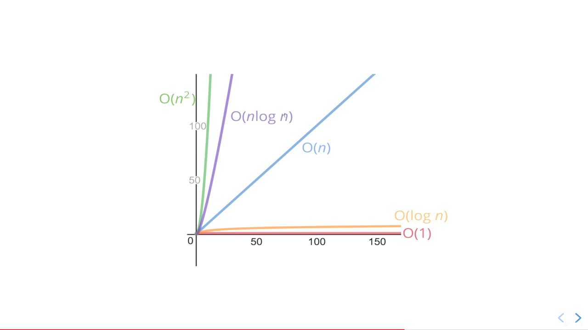
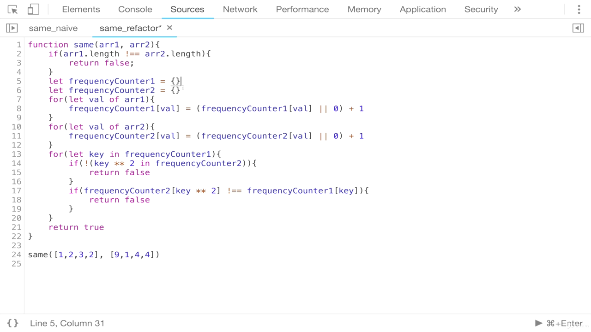
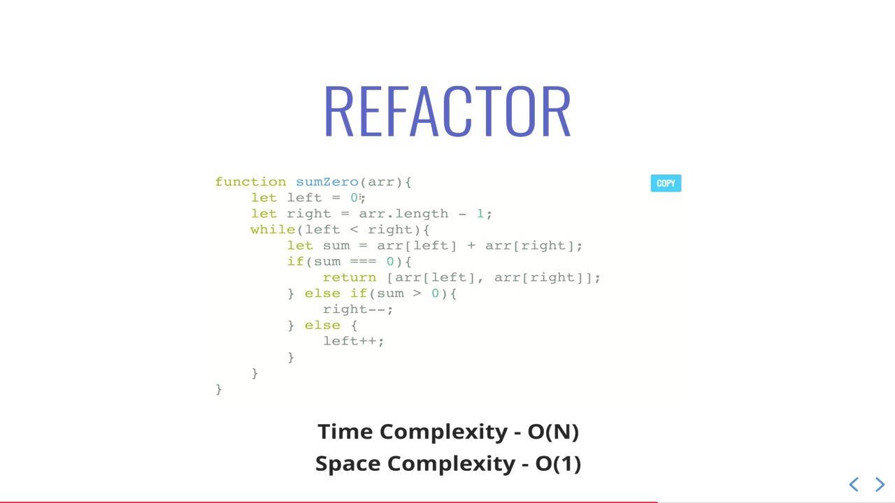
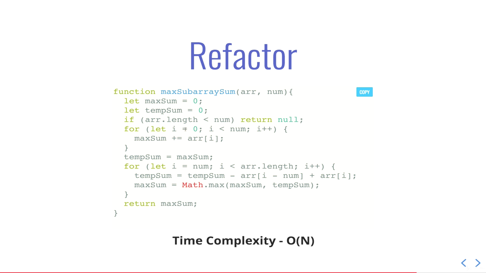
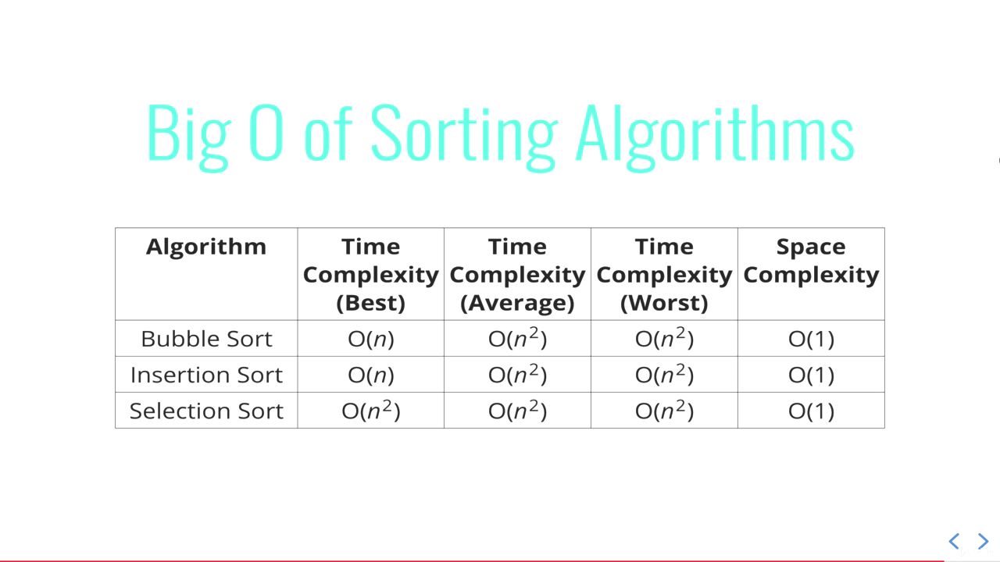
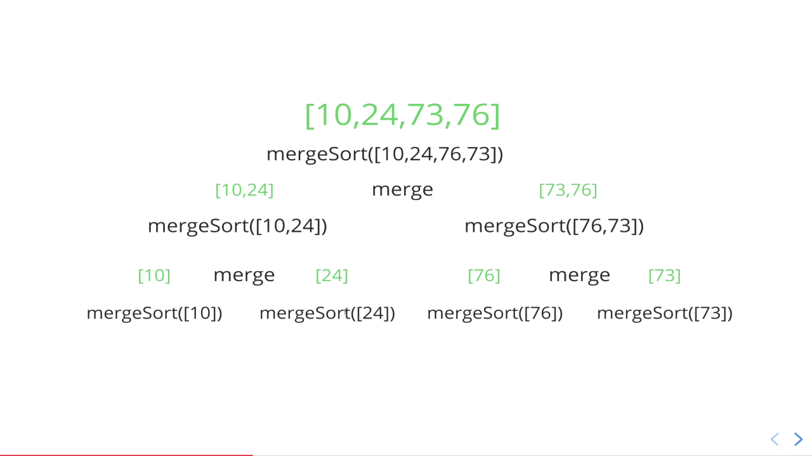
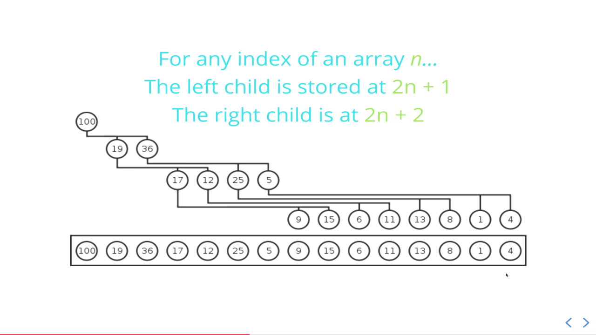

# JavaScript Algorithms and DataStructures

Executing temporary javascript code snippet in browser => Sources Tab -> [+] New snippet -> Write code -> Execute

## Big O

- It's a way of generalizing code and talking about it and comparing code and its performance.
- It's important to have a precise vocabulary to talk about how our code performs
- Useful for discussing trade-offs between different approaches
- Identifying parts of code that are inefficient

When we're talking about Big O, we're talking about upper bound i.e. worst case scenario



### An Example

```javascript
/*
Write a function that calculates the sum of all numbers from 1 up to (and including) some number n
*/

function addUpTo(n) {
  let totoal = 0;
  for (let i = 1; i <= n; i++) {
    total += i;
  }
  return total;
}

// v/s

function addUpTo(n) {
  return (n * (n + 1)) / 2;
}
```

**Checking performance or time taken by function call**

```javascript
let t1 = performance.now();
addUpTo(100000000);
let t2 = performance.now();
console.log(`Time Elapsed: ${(t2 - t1) / 1000} seconds.`);
```

The Problem with Time:

- Different machines will record different times
- The same machine will record different times!
- For fast algorithms, speed measurements may not be precise enough?

### Space Complexity

Sometimes you'll hear the term auxiliary space complexity to refer to space required by the algorithm, not including space taken up by the inputs.

- Most primitives are constant space.
- Strings require O(n) space (where n is the string length).
- Reference types are generally O(n), where n is the length (for arrays) or the number of keys (for objects).

**Examples**

```javascript
function sum(arr) {
  // Space is constant i.e. O(1)
  let total = 0;
  for (let i = 0; i < arr.length; i++) {
    total += arr[i];
  }
  return total;
}

function double(arr) {
  // O(n) space
  let newArr = [];
  for (let i = 0; i < arr.length; i++) {
    newArr.push(2 * arr[i]);
  }
  return newArr;
}
```

## Arrays & Objects Performance

### Objects

Unordered, key value pairs!

**When to use?**

- When you don't need order
- When you need fast access/insertion & removal

**Time Complexities**

O(1) - Insertion, removal & access. O(N) - Searching

_Methods_

Object.keys - O(N)
Object.values - O(N)
Object.entries - O(N)
hasOwnProperty - O(1)

### Arrays

Ordered lists!

**When to use?**

- When you need order
- When you need fast access/insertion and removal (sort of)

**Time Complexities**

O(1) - Access. O(N) - Searching. Varies - Insertion & Removal

Inserting & Removing from beginning of array requires O(N). Whereas from end is O(1)

_Methods_

push - O(1)
pop - O(1)
shift - O(N)
unshift - O(N)
concat - O(N)
slice - O(N) - Returns copy
splice - O(N)
sort - O(N \* log N) - Slowest from others
forEach / map / filter / reduce / etc. - O(N)

## Problem Solving

### Understand the Problem

- Can I restate the problem in my own words?
- What are the inputs that go into the problem?
- What are the outputs that should come from the solution to the problem?
- Can the outputs be determined from the inputs?
- How should I label the important pieces of data that are a part of the problem?

### Explore Examples

- Start with simple examples
- Progress to more complex examples
- Explore examples with empty inputs
- Explore examples with invalid inputs

### Break It Down

Explicitly write out the steps you need to take. This forces you to think about the code you'll write before you write it, and helps you catch any lignering conceptual issues or misunderstandings before you dive in and have to worry about details (e.g. language syntax) as well.

### Solve / Simplify Problem

- Find the core difficulty in what you're trying to do
- Temporarily ignore that difficulty
- Write a simplified solution
- Then incorporate that difficulty back in

### Look Back & Refactor

- Can you check the result?
- Can you derive the result differently?
- Can you understand it at a glance?
- Can you use the result or method for some other problem?
- Can you improve the performance of your solution?
- Can you think of other ways to refactor?
- How have other people solved this problem?

## Problem Solving Patterns

### Frequency Counter

This pattern uses objects or sets to collect values/frequences of values. This can often avoid the need for nested loops or O(N^2) operations with arrays / strings.

**An Example**

Write a function called same, which accepts two arrays. The function should return true if every value in the array has it's corresponding value squared in the second array. The frequency of values must be the same.



### Multiple Pointers

Creating pointers or values that coresspond to an index or position and move towards the beginning, end or middle based on a certain condition.

Very efficient for solving problems with minimal space complexity as well.

**An Example**

Write a function called sumZero which accepts a sorted array of integers. The function should fine the first pair where the sum is 0. Return an array that includes both values that sum to zero or undefined if a pair does not exist.



**Another Example**

Implement a function called countUniqueValues, which accepts a sorted array, and counts the unique values in the array. There can be negative numbers in the array, but it wil always be sorted.

```javascript
countUniqueValues([1, 1, 1, 1, 1, 2]); // 2
countUniqueValues([1, 2, 3, 4, 4, 4, 7, 7, 12, 12, 13]); // 7

// Solution

function countUniqueValues(arr) {
  if (arr.length === 0) return 0;
  var i = 0;
  for (var j = 1; j < arr.length; j++) {
    if (arr[i] !== arr[j]) {
      i++;
      arr[i] = arr[j];
    }
  }
  return i + 1;
}
```

### Sliding Window Pattern

This pattern involves creating a window which can either be an array or number from one position to another. Depending on a certain condition, the window either increases or closes (and a new window is created)

Very useful for keeping track of a subset of data in an array/string, etc.

**An Example**

Write a function called maxSubarraySum which accepts an array of integers and a number called n. The function should calculate the maximum sum of n consecutive elements in the array.

```javascript
maxSubarraySum([1, 2, 5, 2, 8, 1, 5], 2); // 10
maxSubarraySum([1, 2, 5, 2, 8, 1, 5], 4); // 17
```



### Divide and Conquer

This pattern involves dividing a data set into smaller chunks and then repeating a process with a subset of data.

This pattern can tremendously decrease time complexity.

## Recursion

### It's Everywhere

- JSON.parse / JSON.stringify
- document.getElementById and DOM traversal algorithms
- Object traversal

### Helper Method Recursion (Design Pattern)

```javascript
// Dummy code illustrating pattern
function outer(input) {
  var outerScopedVariable = [];

  function helper(helperInput) {
    // modify the outerScopedVariable
    helper(helperInput--);
  }

  helper(input);

  return outerScopedVariable;
}

// Implementation to collect all of the odd values in an array

function collectOddValues(arr) {
  let result = [];

  function helper(helperInput) {
    if (helperInput.length === 0) {
      return;
    }
    if (helperInput[0] % 2 !== 0) {
      result.push(helperInput[0]);
    }
    helper(helperInput.slice(1));
  }

  helper(arr);

  return result;
}
```

### Pure Recursion

```javascript
function collectOddValues(arr) {
  let newArr = []; // this helps us to either concatenate empty array or array with an odd value
  if (arr.length === 0) {
    return newArr;
  }
  if (arr[0] % 2 !== 0) {
    newArr.push(arr[0]);
  }
  newArr = newArr.concat(collectOddValues(arr.slice(1)));
  return newArr;
}
```

## Sorting Algos

### Bubble sort

The largest value bubbles towards the end. The amount of items from need to sort decreases as we progress in iteration.

```javascript
for (var i = arr.length; i > 0; i--) {
  noSwaps = true; // optimization
  for (var j = 0; j < i - 1; j++) {
    // swap if arr[j] > arr[j+1] and noSwaps = false
  }
  if (noSwaps) break; // optimization
}
```

### Selection Sort

Similar to bubble sort, except it places small values into sorted position. We find the minimum and put it at the beginning.

### Insertion Sort

Builds up the sort by gradually creating a larger left half which is always sorted.

- Start picking the second element in the array
- Now compare the second element with the one before it and swap if necessary.
- Continue to the next element and if it is in the incorrect order, iterate through the sorted porition (i.e. left side) to place the element in the correct palce.
- Repeat until the array is sorted.

**Elementary Sorting Time Complexities**



_Note: With nearly sorted data, bubble and insertion perform well._

### Merge Sort

Divide then Merge with sort.

```javascript
function merge(arr1, arr2) {
  let results = [];
  let i = 0;
  let j = 0;
  while (i < arr1.length && j < arr2.length) {
    // while either of the pointers are withing their array length bounds
    if (arr2[j] > arr1[i]) {
      results.push(arr1[i]); // smaller one is pushed into results
      i++; // and the pointer is incremented
    } else {
      results.push(arr2[j]);
      j++;
    }
  }
  // 2 while loops for pushing remaining elements into results. First left side and then right side
  while (i < arr1.length) {
    results.push(arr1[i]);
    i++;
  }
  while (j < arr2.length) {
    results.push(arr2[j]);
    j++;
  }
  return results;
}

function mergeSort(arr) {
  if (arr.length <= 1) return arr;
  let mid = Math.floor(arr.length / 2);
  let left = mergeSort(arr.slice(0, mid));
  let right = mergeSort(arr.slice(mid));
  return merge(left, right);
}
```

Mergesort illustration with downward divide and upward merging with sort from left to right.



### Quicksort

- Works by selecting one element (called the "pivot") and finding the index where the pivot should end up in the sorted array.
- Once the pivot is positioned appropriately, quick sort can be applied on either side of the pivot.

**Picking a pivot**

- The runtime of quick sort depends in part on how one selects the pivot
- Ideally, the pivot should be chosen so that it's roughly the median value in the data set you're sorting.

```javascript
function pivot(arr, start = 0, end = arr.length + 1) {
  const swap = (arr, idx1, idx2) => {
    [arr[idx1], arr[idx2]] = [arr[idx2], arr[idx1]];
  };

  var pivot = arr[start]; // for simplicity first element is pivot
  var swapIdx = start;

  for (var i = start + 1; i < arr.length; i++) {
    if (pivot > arr[i]) {
      swapIdx++; // keeps track of number of elements less than pivot
      swap(arr, swapIdx, i); // making smaller values appear to the right of pivot until pivot is placed at its correct position
    }
  }
  swap(arr, start, swapIdx); // final swap for pivot and swap index
  return swapIdx; // return correct location of pivot
}

function quickSort(arr, left = 0, right = arr.length - 1) {
  if (left < right) {
    let pivotIndex = pivot(arr, left, right);
    // left side
    quickSort(arr, left, pivotIndex - 1);
    // right side
    quickSort(arr, pivotIndex + 1, right);
  }
  return arr;
}
```

### Radix Sort

Radix sort is a special sorting algorithm that works on lists of numbers. It never makes comparisons between elements. It exploits the fact that information about the size of a number is encoded in the number of digits.

More digits means bigger number!

We create 10 buckets representing all possible numbers from 0 to 9.

```javascript
function getDigit(num, i) {
  return Math.floor(Math.abs(num) / Math.pow(10, i)) % 10; // Math.abs for -ve to +ve
}

function digitCount(num) {
  if (num === 0) return 1;
  return Math.floor(Math.log10(Math.abs(num))) + 1; // log10 => 10 to what power gives us the passed number
}

function mostDigits(nums) {
  // Given an array of numbers, returns the number of digits in the largets numbers in the list
  let maxDigits = 0;
  for (let i = 0l i < nums.length; i++) {
    maxDigits = Math.max(maxDigits, digitCount(nums[i]));
  }
  return maxDigits;
}

function radixSort(nums) {
  let maxDigitCount = mostDigits(nums);
  for(let k = 0; k < maxDigitCount; k++) {
    let digitBuckets = Array.from({length: 10}, () => []);
    for(let i = 0; i < nums.length; i++) {
      let digit = getDigit(nums[i], k);
      digitBuckets[digit].push(nums[i]);
    }
    nums = [].concat(...digitBuckets);
  }
}
```

_Time Complexity_
Best: O(nk)
Average: O(nk)
Worst: O(nk)

where, n -> length of array and k -> number of digits (average)

## Classes in JS

JS classes, introcued in ECMAScript 2015, are primarily syntactical sugar over JS's existing prototype-based inheritance.

## Trees

Lists are linear. Trees are non-linear, they can branch.

**Uses of Trees**

- HTML DOM
- Network Routing
- Abstract Syntax Tree
- Artificial Intelligence (like minimax tree)
- Folders in OS / Computer File Systems

### Binary Search Tree

- Every parent node has at most two children
- Left side children nodes are always less than parent
- Right side children nodes are always greater than parent

```javascript
class Node {
  constructor(value) {
    this.value = value;
    this.left = null;
    this.right = null;
  }
}

class BinarySearchTree {
  contructor() {
    this.root = null;
  }
  insert(value) {
    var newNode = new Node(value);
    if (this.root === null) {
      this.root = newNode;
      return this; // return whole tree
    } else {
      var current = this.root;
      while (true) {
        if (value === current.value) return undefined; // or add a frequency for each node
        if (value < current.value) {
          if (current.left === null) {
            // found our spot
            current.left = newNode;
            return this;
          } else {
            current = current.left; // traversing
          }
        } else if (value > current.value) {
          if (current.right === null) {
            current.right = newNode;
            return this;
          } else {
            current = current.right;
          }
        }
      }
    }
  }

  find(value) {
    // returns the value if found
    if (this.root === null) return false;
    var current = this.root,
      found = false;
    while (current && !found) {
      if (value < current.value) {
        current = current.left;
      } else if (value > current.value) {
        current = current.right;
      } else {
        found = true;
      }
    }
    if (!found) return undefined;
    return current;
  }

  contains(value) {
    // returns true/false for a value
    if (this.root === null) return false;
    var current = this.root,
      found = false;
    while (current && !found) {
      if (value < current.value) {
        current = current.left;
      } else if (value > current.value) {
        current = current.right;
      } else {
        return true;
      }
    }
    return false;
  }
}

var tree = new BinarySearchTree();
```

### Tree Traversal

**Breadth First Search**

Traversing Horizontally.

```javascript
class BinarySearchTree {
  // ... methods previously used
  BFS() {
    var node = this.root,
      data = [], // visited
      queue = []; // to visit
    queue.push(node);

    while (queue.length) {
      node = queue.shift(); // FIFO
      data.push(node.value);
      if (node.left) queue.push(node.left);
      if (node.right) queue.push(node.right);
    }
    return data;
  }
}
```

**Depth First Search**

Traversing Vertically.

_InOrder_ [Left - Root - Right] LRoRi

_PreOrder_ [Root - Left - Right] RoLRi

_PostOrder_ [Left - Right - Root] LRiRo

```javascript
class BinarySearchTree {
  // ...
  DFSPreOrder() {
    var data = [];
    function traverse(node) {
      data.push(node.value);
      if (node.left) traverse(node.left);
      if (node.right) traverse(node.right);
    }
    traverse(this.root);
    return data;
  }
  DFSPostOrder() {
    var data = [];
    function traverse(node) {
      if (node.left) traverse(node.left);
      if (node.right) traverse(node.right);
      data.push(node.value);
    }
    traverse(this.root);
    return data;
  }
  DFSInOrder() {
    var data = [];
    function traverse(node) {
      if (node.left) traverse(node.left);
      data.push(node.value);
      if (node.right) traverse(node.right);
    }
    traverse(this.root);
    return data;
  }
}
```

**Which traversal to use?**

When we have a huge tree then Depth First Strategy is more suited as it has lower space complexity.

When we have a skewed tree then Breadth First Strategy is more suited as queue would have like 1 node at most at a time.

DFS - InOrder is mostly used as it gives a sorted order from a Binary Search Tree.

DFS - PreOrder is used when you want to store the tree structure easily as a flattened structure.

## Binary Heaps

Heap is a tree structure very similar to binary search tree but with some different rules. However, each parentt has at most two child nodes. Useful in priority queue.

In a _MaxBinaryHeap_, parent nodes are always larger than child nodes. In a _MinBinaryHeap_, parent nodes are always smaller than child nodes.



Conversely, For any child node at index n... Its parent is at index `(n-1)/2` floored.

**MaxBinaryHeap**

```javascript
class MaxBinaryHeap {
  constructor() {
    this.values = [];
  }
  insert(element) {
    this.values.push(element); // insert at end
    this.bubbleUp(); // bubble up to correct spot
  }
  bubbleUp() {
    let idx = this.values.length - 1; // start as last index and then later swap to parentIdx
    const element = this.values[idx];
    while (idx > 0) {
      let parentIdx = Math.floor((idx - 1) / 2);
      let parent = this.values[parentIdx];
      if (element <= parent) break;
      this.values[parentIdx] = element;
      this.values[idx] = parent;
      idx = parentIdx;
    }
  }

  /*
  For removing from heap, remove the root -> replace with most recently added -> adjust (sink down/bubble-down/heapify-down)
  */
  extractMax() {
    const max = this.values[0];
    const end = this.values.pop();
    if (this.values.length > 0) {
      // edge case
      this.values[0] = end;
      // trickle down
      this.sinkDown();
    }
    return max;
  }

  sinkDown() {
    let idx = 0;
    const length = this.values.length;
    const element = this.values[0]; // find correct spot of this
    while (true) {
      let leftChildIdx = 2 * idx + 1;
      let rightChildIdx = 2 * idx + 2;
      let leftChild, rightChild;
      let swap = null;
      if (leftChildIdx < length) {
        leftChild = this.values[leftChildIdx];
        if (leftChild > element) {
          swap = leftChildIdx; // swap keeping track of position to swap with
        }
      }
      if (rightChildIdx < length) {
        rightChild = this.values[rightChildIdx];
        if (
          (swap === null && rightChild > element) ||
          (swap !== null && rightChild > leftChild)
        ) {
          swap = rightChildIdx;
        }
      }
      if (swap === null) break;
      this.values[idx] = this.values[swap]; // swap has to be larger one between the two children
      this.values[swap] = element;
      idx = swap;
    }
  }
}

let heap = new MaxBinaryHeap();
heap.insert(41);
heap.insert(39);
heap.insert(33);
heap.insert(18);
heap.insert(27);
heap.insert(12);
heap.insert(55);

// [41, 39, 33, 18, 27, 12, 55]

// Stopping at [55, ...]
```
