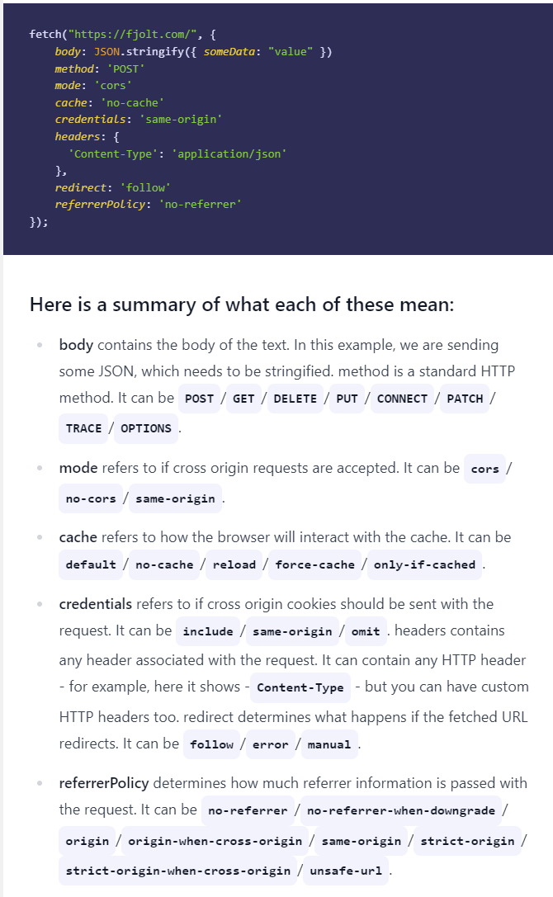

# REpresentational State Transfer (REST) API

- [REpresentational State Transfer (REST) API](#representational-state-transfer-rest-api)
  - [HTTP Verbs](#http-verbs)
  - [Endpoints](#endpoints)
  - [HTTP](#http)
  - [Statelessness](#statelessness)
  - [HTTP Guide](#http-guide)
    - [CORS](#cors)
    - [Fetch](#fetch)

RESTful web services use web protocol i.e. HTTP protocol method.

‘Addressing’ locates resources that are present on the server for the purpose of hosting web services. This is usually done with URI i.e. Unified Resource Identifier.

In REST, ST itself defines State Transfer and Statelessness means complete isolation. This means, the state of the client’s application is never stored on the server and is passed on. Based on the concept of statelessness where every client request and the response is independent of the other with complete assurance of providing required information.
Every client passes a ‘session identifier’ which also acts as an identifier for each session.

There are varieties of representation formats available in order to represent a resource. Some most common are enlisted below:

- JSON
- YAML
- XML
- HTML

Mentioned below are the header of the resources and their brief description so that they can be identified for the caching process:

- Time and Date of resource creation
- Time and date of resource modification that usually stores the last detail.
- Cache control header
- Time and date at which the cached resource will expire.
- The age which determines the time from when the resource has been fetched.

Various cache control header:

- Public: Resources that are marked as the public can be cached by any intermediate components between the client and server.
- Private: Resources that are marked as private can only be cached by the client.
- No cache

Mentioned below is the list of HTTP methods with their descriptions:

- GET: This is a read only operation which fetches the list of users on the server.
- PUT: PUT puts a file or resource at a specific URI, and exactly at that URI. If there's already a file or resource at that URI, PUT replaces that file or resource. PUT is idempotent, but paradoxically PUT responses are not cacheable.
- POST: It submits information to the service for processing; it should typically return the modified or new resource. The POST method is not idempotent, however POST responses are cacheable so long as the server sets the appropriate Cache-Control and Expires headers.
- DELETE: At the request URL it removes the resource.
- OPTIONS: It indicates which techniques are supported.
- HEAD: About the request URL it returns meta information

Result generated with PUT method is always same no matter how many times the operation is performed. On the other hand, the result generated by POST operation is always different every time.
The URI in a PUT request identifies the entity enclosed with the request -- the user agent knows what URI is intended and the server MUST NOT attempt to apply the request to some other resource.

Common status code classes:

- 1xxs – Informational responses: The server is thinking through the request.

- 2xxs – Success! The request was successfully completed and the server gave the browser the expected response.

- 3xxs –Redirection: You got redirected somewhere else. The request was received, but there’s a redirect of some kind.

- 4xxs – Client errors: Page not found. The site or page couldn’t be reached. (The request was made, but the page isn’t valid — this is an error on the website’s side of the conversation and often appears when a page doesn’t exist on the site.)

- 5xxs – Server errors: Failure. A valid request was made by the client but the server failed to complete the request.

100 - Continue
101 - Switching Protocols
102 - Processing

201 - Created - Following a POST command.
202 - Accepted - The request has been accepted for processing, but the processing has not been completed.
203 - Partial Information
204 - No Response - Server has received the request but there is no information to send back, and the client should stay in the same document view.

301 - Permanent Redirect
304 - Not Modified
307 - Temporary Redirect

400 - Bad Request
401 - Unauthorized
402 - Payment Required
403 – Forbidden
404 - Not Found
410 - Gone - A 410 is more permanent than a 404; it means that the page is gone.

501 - Not implemented - The server does not support the facility required.
502 - Service temporarily overloaded
503 - Service Unavailable

## HTTP Verbs

Every webpage contains both an address (the URL) as well as a list of approved actions known as HTTP verbs. The HTTP protocol contains a number of request methods that can be used while requesting information from a server. The four most common map to CRUD functionality. They are POST, GET, PUT, and DELETE. To create content you use POST, to read content GET, to update it PUT, and to delete it you use DELETE.

## Endpoints

A web API has endpoints instead which are URLs with a list of available actions (HTTP verbs) that expose data (typically in JSON)

## HTTP

HTTP is a request-response protocol between two computers that have an existing TCP connection. Every HTTP message consists of a request/status line, headers, and optional body data.

```
GET / HTTP/1.1
Host: google.com
Accept_Language: en-US
```

## Statelessness

A final important point to make about HTTP is that it is a stateless protocol. This means each request/response pair is completely independent of the previous one.

Statelessness brings a lot of benefits to HTTP. Since all electronic communication systems have signal loss over time, if we did not have a stateless protocol, things would constantly break if one request/response cycle didn’t go through. As a result HTTP is known as a very resilient distributed protocol.

Ultimately a web API is a collection of endpoints that expose certain parts of an underlying database.

## HTTP Guide

For a long time, the only HTTP Web API available was XMLHttpRequest or XHR. The more modern version, supported by all browsers except IE, is Fetch - where XHR uses Callbacks, Fetch uses Promises.

For HTTP requests:

Create = POST
Read = GET
Update = PUT or PATCH
Delete = DELETE

### CORS

CORS stands for Cross-Origin Resource Sharing. By default, browsers and servers running JavaScript use CORS to block requests from a client with a different origin than the server for security. The goal of CORS is to protect the client and server from executing malicious code contained in an HTTP request and to prevent data being stolen from the server.

For most browsers, origin refers to the host, the protocol, and the port, if the port is specified.

Before your original request is sent, HTTP will send a preflight request with some headers like the origin and the method to check if the request you want to make is safe. The server then sends back a preflight response with CORS headers like Access-Control-Allow-Origin and Access-Control-Allow-Methods that tell the browser whether the original request is allowed. This is when a request will be blocked by CORS if it's going to be.

_You can only dictate if a server allows CORS requests if you are writing the server code._

If your origin isn't in the list in the Access-Control-Allow-Origin header in the response, your request will be blocked

However, even if the server allows CORS requests, your browser will block a CORS request in your client-side code. You can get around this by requesting data from the server using your own server and then passing what you needed from the response to your client.

### Fetch


