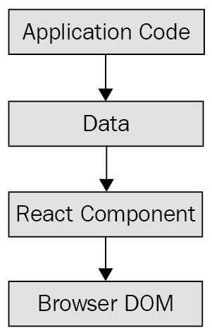
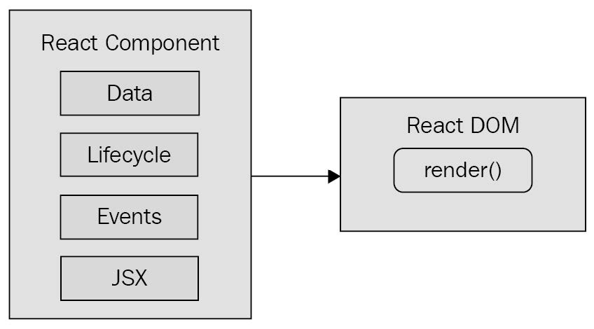
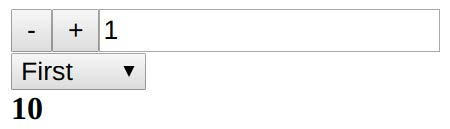
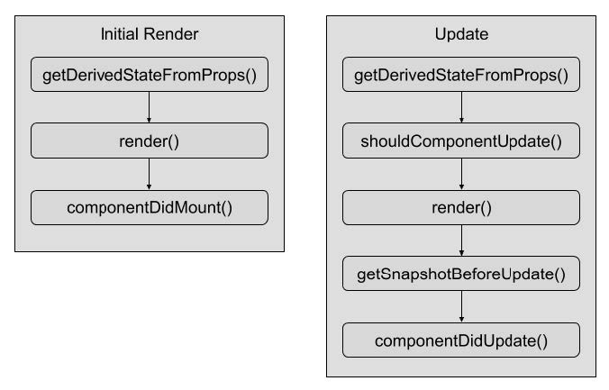
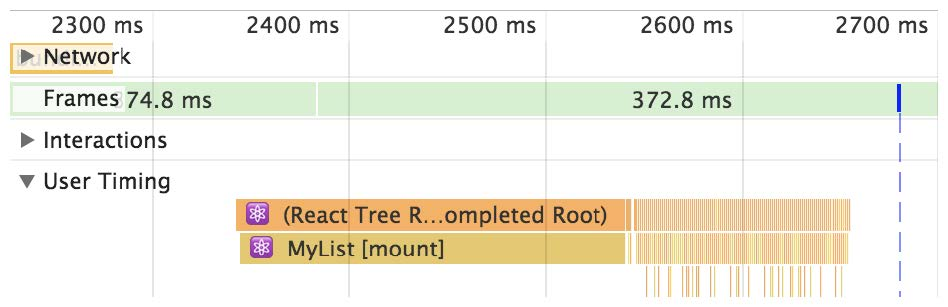
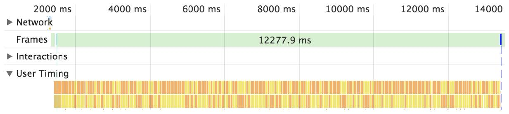

# React

A JavaScript library for building user interfaces.

- [React](#react)
  - [Why React?](#why-react)
  - [React Features](#react-features)
  - [Rendering with JSX](#rendering-with-jsx)
  - [Component Properties, State, and Context](#component-properties-state-and-context)
  - [Hooks](#hooks)
  - [Event Handling](#event-handling)
  - [Crafting Reusable Components](#crafting-reusable-components)
  - [React Component Life Cycle](#react-component-life-cycle)
  - [Code Splitting Using Lazy Components and Suspense](#code-splitting-using-lazy-components-and-suspense)
  - [Server-Side React Components](#server-side-react-components)

## Why React?

React is just the view layer





React is divided into two major APIs:

- The React Component API: These are the parts of the page that are actually
  rendered by React DOM.
- React DOM: This is the API that's used to perform the actual rendering on a web page.

**Declarative UI structures**

React components don't require executing steps in an imperative way. This is why JSX is central to React components. The XML-style syntax makes it easy to describe what the UI should look like. That is, what are the HTML elements that this component is going to render? This is called declarative programming and is very well suited for UI development.

Note: The DOM API is how JavaScript is able to change content on the page.

**Performance**

React has something called the virtual DOM, which is used to keep a representation of the real DOM elements in memory. It does this so that each time we re-render a component, it can compare the new content to the content that's already displayed on the page. Based on the difference, the virtual DOM can execute the imperative steps necessary to make the changes.

When you read about React, you'll often see words such as diffing and patching. Diffing means comparing old content with new content to figure out what's changed. Patching means executing the necessary DOM operations to render the new content.

_Note: Like any other JavaScript library, React is constrained by the run-to-completion nature of the main thread._

## React Features

The features of React 16 include the following:

- Revamped core architecture
- Lifecycle methods
- Context API
- Rendering fragments
- Portals
- Rendering lists and strings
- Handling errors
- Server-side rendering

**(Revamped core arch)[https://reactjs.org/blog/2017/09/26/react-v16.0.html]**

Change made to the internal reconciliation code. Instead of rendering every component on the page in a run-tocompilation way, React renders (fibers)[https://github.com/acdlite/react-fiber-architecture]—smaller chunks of the page that can be prioritized and rendered asynchronously.

**(The Context API)[https://reactjs.org/docs/context.html]**

Provides a way for you to supply your components with data at any tree level.

**(Portals)[https://reactjs.org/docs/portals.html]**

When a React component returns content, it gets rendered into its parent component. Then, that parent's content gets rendered into its parent component and so on, all the way to the tree root. There are times when you want to render something that specifically targets a DOM element. For example, a component that should be rendered as a dialog probably doesn't need to be mounted at the parent. Using a portal, you can control precisely where your component's content is rendered.

React features that were introduced after version 16.6.0:

- Memoizing functional components
- Code splitting and loading
- Hooks

**(Memoizing functional components)[https://reactjs.org/docs/react-api.html#reactmemo]**

Memoized components avoid re-rendering if the component data hasn't changed.

## Rendering with JSX

JSX is transpiled into JavaScript statements; browsers have no idea what JSX is. The render() function tells React to take your JSX markup and transform it into JavaScript statements that update the UI in the most efficient way possible.

When you render HTML tags in JSX markup, the expectation is that you'll use lowercase for the tag name. In fact, capitalizing the name of an HTML tag will fail. Tag names are case-sensitive and non-HTML elements are capitalized.

## Component Properties, State, and Context

A pure function is a function without side effects. That is to say, called with a given set of arguments, the function always produces the same output.

Some components have state that changes over time. These components then pass state values to other components as properties. These stateful components are called container components. **The basic premise of container components is simple: don't couple data fetching with the component that renders the data. The container is responsible for fetching the data and passing it to its child component.**

```jsx
// MyContainer.js
import React, { Component } from "react";
import MyList from "./MyList";

function fetchData() {
  return new Promise((resolve) => {
    setTimeout(() => {
      resolve(["First", "Second", "Third"]);
    }, 2000);
  });
}
export default class MyContainer extends Component {
  state = { items: [] };
  componentDidMount() {
    fetchData().then((items) => this.setState({ items }));
  }
  render() {
    return <MyList {...this.state} />;
  }
}

// MyList.js
export default ({ items }) => (
  <ul>
    {items.map((i) => (
      <li key={i}>{i}</li>
    ))}
  </ul>
);
```

## Hooks

When in doubt, use one `useState()` Hook per state value.

There's a good chance that at some point, your users will navigate around your app and cause components to unmount before responses to their API requests arrive. When this happens, an error occurs because the component will attempt to update the state values of a component that has been removed.

Thankfully, the useEffect() Hook has a mechanism to clean up things such as pending API requests when the component is removed.

```jsx
import React, { Fragment, useEffect, useState } from "react";
import { Promise } from "bluebird";
Promise.config({ cancellation: true });
function fetchUser() {
  return new Promise((resolve) => {
    setTimeout(() => {
      resolve({ id: 1, name: "Adam" });
    }, 1000);
  });
}
export default function User() {
  const [id, setId] = useState("loading...");
  const [name, setName] = useState("loading...");
  useEffect(() => {
    const promise = fetchUser().then((user) => {
      setId(user.id);
      setName(user.name);
    });
    return () => {
      promise.cancel();
    };
  }, []);
  return (
    <Fragment>
      <p>ID: {id}</p>
      <p>Name: {name}</p>
    </Fragment>
  );
}
```

**Using reducer Hooks to scale state management**

A reducer function in a React application is a function that takes the current state, an action, and any other arguments that are needed to update the state. It returns the new state of the component. The action argument tells the reducer function what new state to return and is often used in a switch statement.

```jsx
import React, { Fragment, useReducer } from "react";
function reducer(state, action) {
  switch (action.type) {
    case "changeName":
      return { ...state, name: action.value };
    case "changeAge":
      return { ...state, age: action.value };
    default:
      throw new Error(`${action.type} is not a valid action`);
  }
}
export default function App() {
  const [{ name, age }, dispatch] = useReducer(reducer, {});
  return (
    <Fragment>
      <input
        placeholder="Name"
        value={name}
        onChange={(e) =>
          dispatch({ type: "changeName", value: e.target.value })
        }
      />
      <p>Name: {name}</p>
      <input
        placeholder="Age"
        type="number"
        value={age}
        onChange={(e) => dispatch({ type: "changeAge", value: e.target.value })}
      />
      <p>Age: {age}</p>
    </Fragment>
  );
}
```

The `useReducer()` function takes two arguments: the _reducer_ function that updates the state, and the _initial_ state of the component.
We use the object spread operator to return a new state object, made from the existing state and the updated state object values.

In real applications, there are often scenarios where updating one piece of state means that another piece of state needs to be updated as well, based on this new value.

Let's look at an example that allows the user to select an item and the quantity of that item. It then shows the cost. This means that whenever the quantity or item fields change, the total must also change.

```jsx
import React, { Fragment, useReducer, useEffect } from "react";
const initialState = {
  options: [
    { id: 1, name: "First", value: 10 },
    { id: 2, name: "Second", value: 50 },
    { id: 3, name: "Third", value: 200 },
  ],
  quantity: 1,
  selected: 1,
};
function reduceButtonStates(state) {
  return {
    ...state,
    decrementDisabled: state.quantity === 0,
    incrementDisabled: state.quantity === 10,
  };
}
function reduceTotal(state) {
  const option = state.options.find((option) => option.id === state.selected);
  return { ...state, total: state.quantity * option.value };
}
function reducer(state, action) {
  let newState;
  switch (action.type) {
    case "init":
      newState = reduceTotal(state);
      return reduceButtonStates(newState);
    case "decrementQuantity":
      newState = { ...state, quantity: state.quantity - 1 };
      newState = reduceTotal(newState);
      return reduceButtonStates(newState);
    case "incrementQuantity":
      newState = { ...state, quantity: state.quantity + 1 };
      newState = reduceTotal(newState);
      return reduceButtonStates(newState);
    case "selectItem":
      newState = { ...state, selected: Number(action.id) };
      return reduceTotal(newState);
    default:
      throw new Error(`${action.type} is not a valid action`);
  }
}
```

Here's the _App_ component that uses the reducer:

```jsx
export default function App() {
  const [
    {
      options,
      selected,
      quantity,
      total,
      decrementDisabled,
      incrementDisabled,
    },
    dispatch,
  ] = useReducer(reducer, initialState);
  useEffect(() => {
    dispatch({ type: "init" });
  }, []);
  return (
    <Fragment>
      <section>
        <button
          disabled={decrementDisabled}
          onClick={() => dispatch({ type: "decrementQuantity" })}
        >
          -
        </button>
        <button
          disabled={incrementDisabled}
          onClick={() => dispatch({ type: "incrementQuantity" })}
        >
          +
        </button>
        <input readOnly value={quantity} />
      </section>
      <section>
        <select
          value={selected}
          onChange={(e) => dispatch({ type: "selectItem", id: e.target.value })}
        >
          {options.map((o) => (
            <option key={o.id} value={o.id}>
              {o.name}
            </option>
          ))}
        </select>
      </section>
      <section>
        <strong>{total}</strong>
      </section>
    </Fragment>
  );
}
```

Here's what you'll see when the screen first loads:


The goal is to keep related state operations close to one another since they're related. The perfect place to do this is in a reducer function.

## Event Handling

The differentiating factor with event handling in React components is that it's declarative. Contrast this with something like jQuery, where you have to write imperative code that selects the relevant DOM elements and attaches event handler functions to them.

The advantage of the declarative approach to event handlers in JSX markup is that they're part of the UI structure. Not having to track down code that assigns event handlers is mentally liberating.

**Importing generic handlers**

```jsx
import React, { Component } from "react";
import reverse from "./reverse";
export default class MyList extends Component {
  state = {
    items: ["Angular", "Ember", "React"],
  };
  onReverseClick = reverse.bind(this);
  render() {
    const {
      state: { items },
      onReverseClick,
    } = this;
    return (
      <section>
        <button onClick={onReverseClick}>Reverse</button>
        <ul>
          {items.map((v, i) => (
            <li key={i}>{v}</li>
          ))}
        </ul>
      </section>
    );
  }
}
```

The onReverseClick method actually calls the generic reverse() function. It is created using bind() to bind the context of the generic function to this component instance.

Note: If you have a class-based component, you can bind your function context to the component class so that you have direct access to the component state and properties.

**Binding handlers to elements**

When you assign an event handler function to an element in JSX, React doesn't actually attach an event listener to the underlying DOM element. Instead, it adds the function to an internal mapping of functions. There's a single event listener on the document for the page. When the React component is removed, the handler is simply removed from the list of handlers.

**Using synthetic event objects**

Synthetic events serve two purposes in React:

- They provide a consistent event interface, normalizing browser inconsistencies.
- Synthetic events contain information that's necessary for propagation to work.

**Understanding event pooling**

Every synthetic event wrapper that's created will also need to be garbage collected at some point, which can be expensive in terms of CPU time. When the garbage collector is running, none of your JavaScript code is able to run.

React deals with this problem by allocating a synthetic instance pool. Whenever an event is triggered, it takes an instance from the pool and populates its properties. The pool keeps a reference to the synthetic event instances, so they're never eligible for garbage collection. React never has to allocate new instances either.

However, there is one gotcha that you need to be aware of. It involves accessing the synthetic event instances from asynchronous code in your event handlers. This is an issue because, as soon as the handler has finished running, the instance goes back into the pool. When it goes back into the pool, all of its properties are cleared.

## Crafting Reusable Components

The general rule is that the further your components move from stateful data, the more utility they have, because their property values could be passed in from anywhere in the application.

## React Component Life Cycle



- getDerivedStateFromProps(): This method allows you to update the state of the component based on the property values of the component. This method is called when the component is initially rendered and when it receives new property values.
- render(): Returns the content to be rendered by the component. This is called when the component is first mounted to the DOM, when it receives new property values, and when setState() is called.
- componentDidMount(): This is called after the component is mounted to the DOM. This is where you can perform component initialization work, such as fetching data.
- shouldComponentUpdate(): You can use this method to compare new states or props with current states or props. Then, you can return false if there's no need to re-render the component. This method is used to make your components more efficient.
- getSnapshotBeforeUpdate(): This method lets you perform operations directly on the DOM elements of your component before they're actually committed to the DOM. The difference between this method and render() is that getSnapshotBeforeUpdate() isn't asynchronous. With render(), there's a good chance that the DOM structure could change between when it's called and when the changes are actually made in the DOM.
- componentDidUpdate(): This is called when the component is updated. It's rare that you'll have to use this method.

**To render or not to render**

The shouldComponentUpdate() life cycle method is used to determine whether or not the component will render when asked to.

```jsx
import React, { Component } from "react";
function referenceEquality(arr1, arr2) {
  return arr1 === arr2;
}
function valueEquality(arr1, arr2) {
  for (let i = 0; i < arr1.length; i++) {
    if (arr1[i] !== arr2[i]) {
      return false;
    }
  }
  return true;
}
export default class MyList extends Component {
  state = {
    items: new Array(5000).fill(null).map((v, i) => i),
  };
  shouldComponentUpdate(props, state) {
    if (!referenceEquality(this.state.items, state.items)) {
      return !valueEquality(this.state.items, state.items);
    }
    return false;
  }
  render() {
    return (
      <ul>
        {this.state.items.map((item) => (
          <li key={item}>{item}</li>
        ))}
      </ul>
    );
  }
}
```

The items state is initialized to an array with 5000 items in it. This is a fairly large collection, so you don't want the virtual DOM inside React to constantly diff this list. The virtual DOM is efficient at what it does, but not nearly as efficient as code, which can perform a simple should or shouldn't render check. The shouldComponentRender() method that you've implemented here does exactly that.

Here's what the performance profile looks like for this component:



The initial render takes the longest—a few hundred milliseconds. But then you have all of these tiny time slices that are completely imperceptible to the user experience. These are the result of shouldComponentUpdate() returning false. Let's comment out this method now and see how this profile changes:



**Rendering jQuery UI widgets**

```jsx
import React, { Component } from "react";
import $ from "jquery";
import "jquery-ui/ui/widgets/button";
import "jquery-ui/themes/base/all.css";
export default class MyButton extends Component {
  componentDidMount() {
    $(this.button).button(this.props);
  }
  componentDidUpdate() {
    $(this.button).button("option", this.props);
  }
  render() {
    return (
      <button
        onClick={this.props.onClick}
        ref={(button) => {
          this.button = button;
        }}
      />
    );
  }
}
```

The jQuery UI button widget expects a `<button>` element, so this is what's rendered by the component.

## Code Splitting Using Lazy Components and Suspense

There are two pieces involved with using the new lazy() API in React. First, there's bundling components into their own separate files so that they can be downloaded by the browser separately from other parts of the application. Secondly, once you have created the bundles, you can build React components that are lazy—they don't download anything until the first time they're rendered.

Let's take a look at a simple component that we might want to bundle separately from the rest of the application:

```jsx
import React from "react";
export default function MyComponent() {
  return <p>My Component</p>;
}
```

Now let's take a look at how we would import this module dynamically using the import() function, resulting in a separate bundle:

```jsx
import React, { useState, useEffect } from "react";
export default function App() {
  const [MyComponent, setMyComponent] = useState(() => () => null);
  useEffect(() => {
    import("./MyComponent").then((module) => {
      setMyComponent(() => module.default);
    });
  }, []);
  return <MyComponent />;
}
```

Making components lazy:

```jsx
import React, { Suspense, lazy } from "react";
const MyComponent = lazy(() => import("./MyComponent"));
export default function App() {
  return (
    <Suspense fallback={"loading..."}>
      <MyComponent />
    </Suspense>
  );
}
```

If you have too many lazy components, your app is going to end up making several HTTP requests to fetch them – at the same time. There's no benefit to having separate bundles for components that are used on the same part of the app.

## Server-Side React Components

**Another term for server-side rendering is isomorphic JavaScript.** This is a fancy way of saying JavaScript code that can run in the browser and in Node.js without modification.

In the case of rendering on the server, components are rendered to strings. The server can't actually display rendered HTML; all it can do is send the rendered markup to the browser.

The main motivation behind server-side rendering, for me personally, is improved performance. In particular, the initial rendering just feels faster for the user and this translates to an overall better user experience.

**Rendering to strings**

Component to render:

```jsx
import React from "react";
import PropTypes from "prop-types";
export default function App({ items }) {
  return (
    <ul>
      {items.map((item) => (
        <li key={item}>{item}</li>
      ))}
    </ul>
  );
}
App.propTypes = {
  items: PropTypes.arrayOf(PropTypes.string).isRequired,
};
```

The server that will render this component when the
browser asks for it:

```jsx
import React from "react";
import { renderToString } from "react-dom/server";
import express from "express";
import App from "./App";
const doc = (content) =>
  `
<!doctype html>
<html>
<head>
<title>Rendering to strings</title>
</head>
<body>
<div id="app">${content}</div>
</body>
</html>
`;
const app = express();
app.get("/", (req, res) => {
  const props = { items: ["One", "Two", "Three"] };
  const rendered = renderToString(<App {...props} />);
  res.send(doc(rendered)); // doc() - this creates the basic HTML document template with a placeholder for rendered React
content.
});
app.listen(8080, () => {
  console.log("Listening on 127.0.0.1:8080");
});
```

**Backend routing**

```jsx
import React from "react";
import { renderToString } from "react-dom/server";
import { StaticRouter } from "react-router";
import express from "express";
import App from "./App";
const app = express();
app.get("/*", (req, res) => {
  const context = {};
  const html = renderToString(
    <StaticRouter location={req.url} context={context}>
      <App />
    </StaticRouter>
  );
  if (context.url) {
    res.writeHead(301, {
      Location: context.url,
    });
    res.end();
  } else {
    res.write(`
<!doctype html>
<div id="app">${html}</div>
`);
    res.end();
  }
});
app.listen(8080, () => {
  console.log("Listening on 127.0.0.1:8080");
});
```

**Frontend reconciliation**

The user wants to use the application and the server needs to deliver the client's code bundle.

index.js

```jsx
import React from "react";
import { hydrate } from "react-dom";
import App from "./App";
hydrate(<App />, document.getElementById("root"));
```

In this case, you're using the hydrate() function instead of the render() function. The two functions have the same end result—rendered JSX content in the browser window. The hydrate() function is different because it expects rendered component content to already be in place. This means that it will perform less work because it will assume that the markup is correct and doesn't need to be updated on the initial render.

Only in development mode will React examine the entire DOM tree of the server-rendered content to make sure that the correct content is displayed. If there's a mismatch between the existing content and the output of the React components, you'll see warnings that show you where these mismatches happened so that you can go and fix them.
