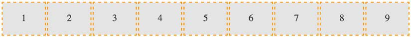
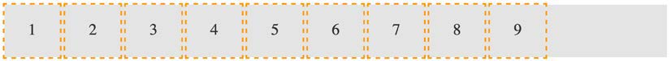
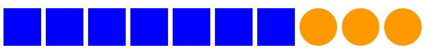
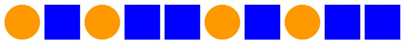
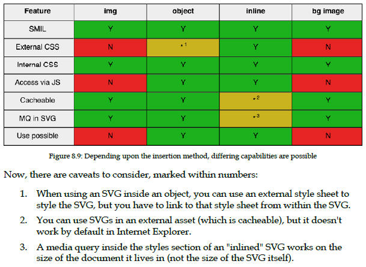

# Responsive Web Design

- [Responsive Web Design](#responsive-web-design)
  - [Essentials](#essentials)
  - [HTML Markup](#html-markup)
  - [Media Query](#media-query)
  - [Flex](#flex)
  - [CSS Grid](#css-grid)
  - [CSS Selectors, Typography, Color Modes, and More](#css-selectors-typography-color-modes-and-more)
  - [Stunning Aesthetics with CSS](#stunning-aesthetics-with-css)
  - [Using SVGs for Resolution Independence](#using-svgs-for-resolution-independence)
  - [Transitions, Transformations, and Animations](#transitions-transformations-and-animations)
  - [Forms](#forms)
  - [Extras](#extras)

## Essentials

We can make the page more mobile-friendly by adding this snippet in the `<head>`:

```html
<meta name="viewport" content="width=device-width,initial-scale=1.0" />
```

our viewport meta tag is effectively saying "make the content render at the width of the device."

The first rules we write outside of a media query should be our starter or "base" rules for the most basic devices, which we then enhance for more capable devices and larger screens.

## HTML Markup

Presently the void tags are `area`, `base`, `br`, `col`, `embed`, `hr`, `img`, `input`, `link`, `meta`, `param`, `source`, `track`, and `wbr`.

You can't wrap one `<a>` tag within another `<a>` tag or other interactive element (such as a button) and you can't wrap a form in an `<a>` tag either.

`<main>` - "The main content area of a document includes content that is unique to that document and excludes content that is repeated across a set of documents such as site navigation links, copyright information, site logos and banners and search forms (unless the document or applications main function is that of a search form)."

`<section>` - as the wrapping element for visual components. It provides a simple way to see the beginning and end of components in the markup. You can also qualify for yourself whether you should be using a section based upon whether the content you are sectioning has a natural heading within it (for example, an h1-h6). If it doesn't, it's likely you'd be better off opting for a div.

`<nav>` - wrap major navigational links to other pages or parts within the same page. If you usually mark up your navigational elements with an unordered list (`<ul>`) and a bunch of list tags (`<li>`), you may be better served with a nav and a number of nested `<a>` tags instead

`<article>` - wrap a self-contained piece of content. Obvious examples of content that should be wrapped with an `<article>` element would be blog posts or news stories. Be aware that if you are nesting `<article>` elements, it is presumed that the nested `<article>` elements are principally related to the outer article.

`<aside>` - content that is tangentially related to the content around it. Considered suitable for pull quotes, advertising, and groups of navigation elements; basically, anything not directly related to the main content would work well in an aside.

`<header>` - can be used for the "masthead" area of a site's header but also as an introduction to other content, such as an introduction section within an `<article>` element.

`<footer>` - contain information about the section it sits within. It can
be used multiple times within a page if needed. For example, it could be used for the footer of a blog but also a footer within a blog post `<article>`.

**HTML5 outline algorithm**

HTML5 introduced the ability for each sectioning container to have its own self-contained outline. That means it is not necessary to think about which level of heading tag you're at in terms of the entire document.

**Note on h1-h6 elements**

A quote from the HTML5 specification:

_"h1–h6 elements must not be used to mark up subheadings, subtitles, alternative titles and taglines unless intended to be the heading for a new section or subsection."_

The `<p>` element is used to markup a paragraph. However, don't think that means it can only be used on text 3-4 lines long. On the contrary, use it to mark up any text that cannot be better marked up with one of the other elements.

A `blockquote` is used to markup text that is quoted from somewhere else.

The HTML specification relates that the `<figure>` element: "...can thus be used to annotate illustrations, diagrams, photos, code listings, etc."
So we use it as an element to call out visuals of any sort, and the accompanying `<figcaption>` provides the means to add some text supporting the visuals.

How many times have you wanted to create a simple open and close widget on your page? A piece of summary text that when clicked, opens a panel with additional information? Modern HTML facilitates this pattern with the `<details>` and `<summary>` elements. Currently, there is no way of animating the open and close.

`<address>` - element is to be used explicitly for marking up contact information for its nearest `<article>` or `<body>` ancestor.

`<strong>` - If you do want to emphasize something for strength, urgency, or importance, `<strong>` is the element for you. The strong element can be used in a heading, caption, or paragraph to distinguish the part that really matters from other parts that might be more detailed, more jovial, or merely boilerplate.

`<em>` - element represents stress emphasis of its contents. Therefore, unless you actually want the enclosed contents to be emphasized, consider using a `<b>` tag or, where relevant, an `<i>` or `span` tag instead.

`<i>` - A span of text in an alternate voice or mood, or otherwise offset from the normal prose in a manner indicating a different quality of text.

`<source>` - enables us to provide alternate sources for media. For example,
alongside providing an MP4 version of a video, if we wanted to provide support for a new format, we could easily do so. Furthermore, if the user didn't have any suitable playback technology in the browser, we could provide download links to the files themselves.

```html
<video
  width="640"
  height="480"
  controls
  preload="auto"
  loop
  poster="myVideoPoster.png"
>
  <source src="myVideo.sp8" type="video/super8" />
  <source src="myVideo.mp4" type="video/mp4" />
  <p>
    <b>Download Video:</b> MP4 Format:
    <a
      href="myVideo.
mp4"
      >"MP4"</a
    >
  </p>
</video>
```

The browser goes top to bottom deciding what to play, so if it doesn't support super8, it moves on to the next source, mp4 in this case.

**Audio and video tags work almost identically**

However, HTML video implementation is not responsive. Simply remove width and height attribute and add `video { max-width: 100%; height: auto; }`

## Media Query

The `<meta>` tag can also be used to control the amount a user can zoom in and out of the page.

```html
<meta
  name="viewport"
  content="width=device-width, maximum-scale=3,
minimum-scale=0.5"
/>
<!-- allows users to go as large as three times the device's width and as small as half the device's width -->
```

_A media query consists of a media type and zero or more expressions that check for the conditions of particular media features. Among the media features that can be used in media queries are 'width', 'height', and 'color'. By using media queries, presentations can be tailored to a specific range of output devices without changing the content itself._

You can write media queries in links in HTML—to load particular style sheets if the media query passes. You can write media queries on CSS @import at-rules to determine which style sheets should be imported. You can also write media queries directly into a CSS file to determine which rules should be applied on the basis of which media queries resolve to true.

**Media queries in link tags**

```html
<link
  rel="stylesheet"
  media="screen and (orientation: portrait)"
  href="portrait-screen.css"
/>
<!-- media query is asking "Are you a screen and is your orientation portrait?" -->
```

**Media query on an @import at-rule**

```scss
@import url("portrait-screen.css") screen and (orientation: portrait);
```

**What can media queries test for?**

- width
- height
- device-width
- device-height
- orientation
- aspect-ratio
- device-aspect-ratio
- color
- color-index
- monochrome
- resolution
- scan
- grid

Ordinarily, for a browser, CSS is considered to be a render-blocking asset. However, modern browsers are smart enough to discern which style sheets, (linked with media queries in the head) need to be analyzed immediately and which can be deferred until after the initial page rendering.

Apart from preference and/or compartmentalization of code, there is rarely a great tangible advantage in separating different media query styles into separate files. After all, using separate files increases the number of HTTP requests needed to render a page, which in turn can make pages slower in certain other situations.

## Flex

The biggest issue with using inline-block as a layout mechanism is that it renders a space between HTML elements. It's also worth pointing out that there is no simple way to vertically center content within an inline-block.

**Table and table-cell**

Don't confuse `display: table` and `display: table-cell` with the equivalent HTML elements. These CSS properties merely mimic the layout of their HTMLbased brethren. They in no way affect the structure of the HTML.

For one, using `display: table` with a `display: table-cell` child enabled consistent and robust vertical centering of elements. Also, `table-cell` elements inside table elements space themselves perfectly; they don't suffer rounding issues like floated elements.

**Flexbox overcomes them all**

**Inline-flex**
Flexbox has an inline variant to complement _inline-block_ and _inline-table_.

**The align-self property**
Individual flex items can use the align-self property to align themselves.

```html
<style>
  .FlexWrapper {
    background-color: indigo;
    display: flex;
    height: 200px;
    width: 400px;
  }
  .FlexItem {
    background-color: #34005b;
    display: flex;
    height: 100px;
    width: 200px;
  }
  .AlignSelf {
    align-self: flex-end;
  }
</style>
<div class="FlexWrapper">
  <div class="FlexItem">I am content in the inner Flexbox 1</div>
  <div class="FlexItem AlignSelf">I am content in the inner Flexbox 2</div>
  <div class="FlexItem">I am content in the inner Flexbox 3</div>
</div>
```

For items within a flex container, if a flex property is present, it is used to size the item rather than a width or height value (if also present). However, it is important to note that if the item you are adding the flex property to is not a flex item, the flex property will have no effect.

- **flex-grow** (the first value you can pass to flex) is the amount, in relation to the other flex items, the flex item can grow when free space is available.
- **flex-shrink** is the amount the flex item can shrink, in relation to the other flex items, when there is not enough space available.
- **flex-basis** (the final value you can pass to flex) is the basis size the flex item is sized to.

If you set the flex-shrink value to zero, then the flex-basis value effectively behaves like a minimum width.

**Simple sticky footer**

Suppose you want a footer to sit at the bottom of the viewport when there is not enough content to push it there. This has always been a pain to achieve, but with Flexbox it's simple. Consider this markup:

```html
<style>
  html,
  body {
    margin: 0;
    padding: 0;
  }
  html {
    height: 100%;
  }
  body {
    font-family: "Oswald", sans-serif;
    color: #ebebeb;
    display: flex;
    flex-direction: column;
    min-height: 100%;
  }
  .MainContent {
    flex: 1 0 auto;
    color: #333;
    padding: 0.5rem;
  }
  .Footer {
    background-color: violet;
    padding: 0.5rem;
  }
</style>

<body>
  <div class="MainContent">
    Here is a bunch of text up at the top. But there isn't enough content to
    push the footer to the bottom of the page.
  </div>
  <div class="Footer">
    However, thanks to flexbox, I've been put in my place.
  </div>
</body>
```

**Simple resolution switching with srcset**

```html
<!--One is a smaller size for smaller viewports, another caters for medium-sized viewports, and, finally, a larger version covers off every other viewport.-->

```

In this example, 1.5x and 2x have been used but any integer would be valid.

**Advanced switching with srcset and sizes**

```html
<!--We are adding a value with a w suffix. This tells the browser how wide the image is. w-suffixed value isn't a "real" size. It's merely an indication to the browser, roughly equivalent to the width in "CSS pixels."-->

```

**picture element**

We need three different images that are most appropriate at different viewport ranges. Here is how we could solve this with picture:

```html
<picture>
  <source media="(min-width: 480px)" srcset="cake-table.jpg" />
  <source media="(min-width: 960px)" srcset="cake-shop.jpg" />
  
</picture>
```

First of all, be aware that when you use the picture element, it is merely a wrapper to facilitate other images making their way to the img tag within. If you want to style the images in any way, it's the img tag that should get your attention.

## CSS Grid

A Grid will quite happily allow a Flexbox inside it. Equally, part of your interface coded with Grid can quite happily live inside a Flexbox, standard block, or inline-block.

A key takeaway is that when you place items within a grid, you can do so referencing the grid lines (which, therefore, implies a grid area) or the grid areas themselves if named.

Simple Grid:

```html
<style>
  .my-first-grid {
    display: grid;
    grid-gap: 10px;
    grid-template-rows: 200px 200px;
    grid-template-columns: 200px 200px;
    background-color: #e4e4e4;
  }
  .grid-item-1 {
    grid-row: 1;
    grid-column: 1;
  }
  .grid-item-2 {
    grid-row: 1;
    grid-column: 2;
  }
  .grid-item-3 {
    grid-row: 2;
    grid-column: 1;
  }
  .grid-item-4 {
    grid-row: 2;
    grid-column: 2;
  }
  [class^="grid-item"] {
    outline: 3px dashed #f90;
    font-size: 30px;
    color: #333;
  }
</style>
<div class="my-first-grid">
  <div class="grid-item-1">1</div>
  <div class="grid-item-2">2</div>
  <div class="grid-item-3">3</div>
  <div class="grid-item-4">4</div>
</div>
```

Because we have used grid and not inline-grid, the grid fills the entire width of the page, despite the fact that our grid items don't need all that space.

_To control how Grid handles items implicitly with the following properties: `grid-auto-rows` and `grid-auto-columns`._

The `grid-auto-flow` property allows you to define the direction that any implicitly added items flow inside the grid. E.g. `grid-auto-flow: column` to make the items flow across the page instead of down.

**gap** - The gap property lets you specify a gap between grid tracks. You might see grid-gap used instead of gap.

**repeat** - repeat() function provides a convenient way of stamping out the needs of any number of items. E.g. create four columns, all 1fr in width `repeat(4, 1fr)`

**fr units** - unit represents "flexible length" and stands for "flex fraction."

**Placing items in the grid**

```css
.grid-item3 {
  grid-column: 2/-1;
}
```

The grid-column property is being set to start at the second grid line and end at the -1 grid line. The first number is the start point, which is separated from the endpoint with a forward slash. Positive numbers count from the start side, while negative numbers start from the end side. So, -1 basically just means the last grid line.

**Named grid lines**

```css
.my-first-grid {
  display: inline-grid;
  grid-gap: 10px;
  grid-template-columns:
    [left-start] 200px [left-end center-start]
    200px [center-end right-start] 200px [right-end];
  grid-template-rows: 200px 200px 200px;
  background-color: #e4e4e4;
}
```

The first column grid line we have named left-start, and the one after the first column we have named left-end. In the center grid line, we have assigned two names: left-end and center-start.

**grid-template-areas**

Yet another way you can work with Grid is to create grid template areas to establish the areas of your grid.

```css
grid-template-areas:
  "one two three"
  "four five six"
  "seven eight nine";
```

**auto-fit and auto-fill**

With the help of auto-fill or auto-fit, we can create a fully responsive grid that adds/removes columns based upon the available size of the viewport, with no media queries needed.

Consider a 9-column grid, where each column is at least 300px wide.

```css
grid-template-columns: repeat(auto-fit, minmax(300px, 1fr));
```

We have told the browser to repeatedly create auto-fit columns, and we define the width of those columns using the minmax function.

**minmax()**

It's a CSS function that allows you to set up a range for the browser. You specify a minimum size and a maximum size, and it computes something in between based on the available space.

**Difference between auto-fit and auto-fill**

```css
grid-template-columns: repeat(auto-fit, minmax(100px, 1fr));
```



```css
grid-template-columns: repeat(auto-fill, minmax(100px, 1fr));
```



**grid-template shorthand**

```css
/** A grid with two 200px rows and three 300px columns */
grid-template: repeat(2, 200px) / repeat(3, 300px);
/** Add grid-template-areas too if you like */
grid-template:
  [rows-top] "a a a" 200px
  "b b b" 200px [rows-bottom]
  / 300px 300px 300px;
```

Above addition of grid-template-areas compiles to:

```css
grid-template-rows: [rows-top] 200px 200px [rows-bottom];
grid-template-columns: 300px 300px 300px;
grid-template-areas: "a a a" "b b b";
```

## CSS Selectors, Typography, Color Modes, and More

A `::before` behaves like a first child of the element and an `::after` behaves like a last child.

**CSS substring matching attribute selectors**

The three options are whether the attribute:

- Begins with a certain substring
- Contains an instance of a certain substring
- Ends with a certain substring

"beginning with" substring matching attribute selector:

```css
[data-type^="todo"] {
  /* Styles */
}
```

"contains an instance of" substring matching attribute selector:

```html
<style>
  [data-ingredients*="cream"] {
    color: red;
  }
</style>
<p data-ingredients="scones cream jam">Will I get selected?</p>
```

"ends with" substring matching attribute selector:

```css
[attribute$="value"] {
  /* Styles */
}
```

**nth-based selectors**

- nth-child(n)
- nth-last-child(n)
- nth-of-type(n)
- nth-last-of-type(n)

For example, `:nth-child(3n+1)` would start at the first element, and then select every third element.

Another case, `(2n+3)` right-most number (the "3" here indicates the third item from the left) and know it will select every second element from that point on.

`:nth-child(1n+2)`, you don't actually need the first number 1 as, unless otherwise stated, n is equal to 1. Likewise, if we wanted to select every third element, rather than write `:nth-child(3n+3)`, we could just write `:nth-child(3n)` as every third item would begin at the third item anyway, without needing to state it explicitly.

The expression can also use negative numbers; for example, `:nth-child(3n-2)` starts at minus 2 and then selects every third item.

You can also change the direction. `:nth-child(-2n+3)` finds the third item again, but then goes in the opposite direction to select every two elements.

`nth-child` and `nth-last-child` differ in that the `nth-last-child` variant works from the opposite end of the document tree. For example, `:nth-last-child(-n+3)` starts at 3 from the end and then selects all the items after it.



`:nth-of-type` and `:nth-last-of-type` let you be specific about the type of item you want to select.

```html
<style>
  .span-class:nth-of-type(-2n + 3) {
    background-color: #f90;
    border-radius: 50%;
  }
</style>
<span class="span-class"></span>
<span class="span-class"></span>
<span class="span-class"></span>
<span class="span-class"></span>
<span class="span-class"></span>
<div class="span-class"></div>
<div class="span-class"></div>
<div class="span-class"></div>
<div class="span-class"></div>
<div class="span-class"></div>
```

Even though all the elements have the same span-class class, they don't get seen as one group.



**Chaining**

```css
/* Get me every fourth item and of those, only ones that are in
the last four items */
.Item:nth-child(4n+1):nth-last-child(-n+4),
/* Now get me every one after that same collection too. */
.Item:nth-child(4n+1):nth-last-child(-n+4) ~ .Item {
  border-bottom: 0;
}
```

It's important to understand when you chain nth selectors like this that the first selector doesn't "filter" the selection for the next selector; rather, the element has to match each of the selections.

**The subsequent sibling**

If we wanted to select all items after the third:

```css
.item:nth-child(3) ~ .item {
  border: 3px dashed #f90;
}
```

**The empty (:empty) selector**

I've encountered situations where I have an element that includes some padding on the inside and gets content dynamically inserted. Sometimes, it gets content inserted, while sometimes, it doesn't. The trouble is, when it doesn't include content, I still see the padding.

```css
.thing {
  padding: 1rem;
  background-color: violet;
}
.thing:empty {
  display: none;
}
```

Note: Whitespace is not "no" space! Be aware that a comment doesn't affect whether an element is considered "empty" or not.

**Responsive viewport-percentage lengths (vmax, vmin, vh, and vw)**

- The vw unit, where each vw unit is 1% of the viewport width.
- The vh unit, where each vh unit is 1% of the viewport height.
- The vmin unit (for viewport minimum; equal to the smaller of either vw or vh).
- The vmax (viewport maximum; equal to the larger of either vw or vh).

However, you can perhaps find more utility for these units when coupled with fonts.

```css
/** The text will always be sized as a percentage of the viewport width. */
.Hero-text {
  font-size: 25vw;
}
```

There is a new mathematical expression on the way to CSS called `clamp()`, which lets us specify a minimum, maximum, and variable size. For example, we might opt for a headline like this: `.headline { font-size: clamp(20px, 40vw, 80px) }`. And while our headline text might vary in size, depending upon the viewport, it would never be less than 20px or larger than 80px.

**env() environment variables**

Properties that can be read in from the environment we are operating in. E.g. `safe-area-inset` in notched mobile phones. `padding-top: env(safe-area-inset-top);`

**Using @supports to fork CSS**

```css
@supports (display: grid) {
  .Item {
    display: inline-grid;
  }
}
@supports not (display: grid) {
  .Item {
    display: inline-flex;
  }
}
@supports ((display: flex) and (pointer: coarse)) {
  .Item {
    display: inline-flex;
  }
}
```

**Web typography**

Things have pretty much settled on `.woff` and the newer `.woff2`.

**System fonts**

Each operating system has its own set of fonts that come preinstalled. We've grown accustomed to writing font "stacks," which enable us to write a font "wish list" for the browser.

```css
font-family: -apple-system, BlinkMacSystemFont, Roboto, Ubuntu, "Segoe UI",
  "Helvetica Neue", Arial, sans-serif;
```

For a lot of situations, using system fonts is a compelling choice. There is zero network overhead and you'll never have to worry about fonts not loading or seeing unsightly jumps on the page as one font is replaced with another.

**The @font-face CSS rule**

The Embedded OpenType (files with an .eot extension) font was Internet Explorer's, and not anyone else's, preferred choice. Others favored the more common TrueType (the.ttf file extension), while there was also Scalable Vector Graphics (.svg) and then the Web Open Font Format (the.woff / .woff2 extension).
As of 2020, you really only need to consider WOFF (Web Open Font Format)

```css
@font-face {
  font-family: "InterRegular";
  src: url("Inter-Regular.woff2") format("woff2"), url("Inter-Regular.woff")
      format("woff");
  font-weight: normal;
  font-style: normal;
  font-display: fallback;
}
```

If we were to place fonts in a folder inventively called fonts on the same level as a css folder, we would need to amend our paths. We need to put `src: url('../fonts/Inter-Regular.woff2') format('woff2'), url('../fonts/Inter-Regular.woff') format('woff');`

**Optimizing font loading with font-display**

If your main font is a web font, it's a good idea to request the file up front by loading it with a link in the head section of your HTML with the rel attribute value as preload.

```html
<link
  rel="preload"
  href="fonts/inter.var.woff2"
  as="font"
  type="font/woff2"
  crossorigin
/>
```

Adding a link with rel="preload" added in this way triggers a request for the web font early in the critical rendering path, without having to wait for the CSSOM to be created. While this technique is recommended by Google, even if other browsers don't do the same, it is unlikely to do any harm. It's only worth doing this for the .woff2 file. Browsers that support .woff2 also support the preload value in the rel attribute.

**font-display**

It provides some control over how fonts should get displayed. The `fallback` value we have provided sets an extremely short "block" period and a short "swap" period.

_swap_: There is a very short blocking period (100 ms is the recommended amount) to let the web font load; otherwise, a system font shows and the web font can be swapped in whenever it is available.

_fallback_: This option prevents a web font from replacing a system font if a set amount of time has passed (3 seconds is the recommendation). This option blocks for around 100 ms initially and allows a swap for up to 3 s, but after that, if the web font subsequently arrives, it doesn't get applied.

**Variable fonts**

First, let's consider how we tell the browser we are working with a variable font in the first place.

```css
@font-face {
  font-family: "Inter-V";
  src: url("fonts/inter.var.woff2") format("woff2-variations");
  font-weight: 100 900;
  font-style: oblique 0deg 10deg;
  font-display: fallback;
}
```

The first thing to note is the `format`. We are setting this to `woff2-variations` to tell the browser this is a font file that makes use of variations. The next thing to keep in mind is that we are using a range for font-weight.
The `oblique` keyword tells the browser the next values relate to how oblique the font can be, and the two values after that define the range.

**Custom axis**

Variable fonts can include their own axis. For example, the "FS Pimlico Glow VF" font has a "glow" axis. You can amend that like this: `font-variation-settings: 'GLOW' 500;`

**Font features**

Variable fonts can also include their own "features." All of those "features" are settings that can be turned on with CSS. You can play about with these settings for yourself [here](https://rsms.me/inter/
lab/?varfont=1)

When we want to apply these custom features, we make use of the font-featuresettings property. `font-feature-settings: 'zero';`

## Stunning Aesthetics with CSS

**Text shadows with CSS**

Basic:

```css
.element {
  text-shadow: 1px 1px 1px #ccc;
}
```

_Remember, the values in shorthand rules always go right and then down (or think of it as clockwise if you prefer)._ Therefore, the first value is the amount of shadow to the right, the second is the amount down, the third value is the amount of blur (the distance the shadow travels before fading to nothing), and the final value is the color. Shadows to the left and above can be achieved using negative values.

It's possible to add multiple text shadows by comma separating two or more
shadows. `text-shadow: 0px 1px #fff, 4px 4px 0px #dad7d7;`

**Box shadows**

Box shadows allow you to create a box-shaped shadow around the outside or inside of an element. Syntax: horizontal offset, vertical offset, blur, spread (we will get to spread in a moment), and color.

```css
.shadow {
  box-shadow: 0px 3px 5px #444;
}
```

The default box-shadow is set on the outside of the element.

The `spread` value lets you extend or contract the shadow in all directions by the amount specified. A negative value is pulling the shadow back in all directions.

**Background gradients**

_Linear-gradient notation_

With a CSS `background-image` gradient, however, things are far more flexible. `background: linear-gradient(to top right, red, blue);` or `background: linear-gradient(45deg, red, blue);`

However, keep in mind that on a rectangular box, a gradient that heads "to top right" (always the top right of the element it's applied to) will end in a slightly different position than "45deg" (always 45 degrees from its starting point).

It's worth knowing you can also start gradients before they are visible within a box. E.g. `background: linear-gradient(red -50%, blue);`

**Color stops**

They provide the means to set which color is used at which point in a gradient.

```css
background: linear-gradient(
  #f90 0,
  #f90 2%,
  #555 2%,
  #eee 50%,
  #555 98%,
  #f90 98%,
  #f90 100%
);
```

A direction has not been specified, so the default top to bottom direction applies.

**Radial background gradients**

`background: radial-gradient(12rem circle at bottom, yellow, orange, red);`

To simplify the notation: size, shape, and position before the first comma, then as many color stops as needed after it (with each stop separated with commas).

**Handy "extent" keywords for responsive sizing**

`background: radial-gradient(closest-side circle at center, #333, blue);`

- closest-side: The shape meets the side of the box nearest to the center (in the case of circles), or meets both the horizontal and vertical sides that are closest to the center (in the case of ellipses).
- closest-corner: The shape meets exactly the closest corner of the box from its center.
- farthest-side: The opposite of closest-side, in that rather than the shape meeting the nearest size, it's sized to meet the one farthest from its center (or both the furthest vertical and horizontal side in the case of an ellipse).
- farthest-corner: The shape expands to the farthest corner of the box from the center.
- cover: Identical to farthest-corner.
- contain: Identical to closest-side.

**Repeating gradients**

`background: repeating-radial-gradient(black 0px, orange 5px, red 10px);`

Firstly, prefix the `linear-gradient` or `radial-gradient` with `repeating-`.

**Background gradient patterns**

```css
.carbon-fibre {
  background: radial-gradient(black 15%, transparent 16%) 0 0, radial-gradient(
        black 15%,
        transparent 16%
      ) 8px 8px,
    radial-gradient(rgba(255, 255, 255, 0.1) 15%, transparent 20%) 0 1px, radial-gradient(
        rgba(255, 255, 255, 0.1) 15%,
        transparent 20%
      ) 8px 9px;
}
```

**Stacked background image**

Let's create a simple space scene, made with a single element and three background images, set at three different sizes, and positioned in three different ways:

```css
.bg-multi {
  height: 100vh;
  width: 100vw;
  background: url("rosetta.png"), url("moon.png"), url("stars.jpg");
  background-size: 75vmax, 50vw, cover;
  background-position: top 50px right 80px, 40px 40px, top center;
  background-repeat: no-repeat;
}
```

We have the stars image at the bottom, then the moon, and finally an image of the Rosetta space probe on top.

Where no background-position is declared, the default position of top left is applied.

**High resolution background images**

Thanks to media queries, we have the ability to load in different background images, not just at different viewport sizes, but also different viewport resolutions.

```css
.bg {
  background-image: url("bg.jpg");
}
@media (min-resolution: 1.5dppx) {
  .bg {
    background-image: url("bg@1_5x.jpg");
  }
}
```

In this example, we are defining the minimum resolution that bg@1_5x.jpg should use as 1.5dppx (device pixels per CSS pixel). We could also use dpi (dots per inch) or dpcm (dots per centimeter) units if preferable.
"Standard" resolution would be 96dpi, twice that resolution would be 192dpi, and so on.

**CSS filters**

There is a glaring problem with box-shadow. As the name implies, it is limited to the rectangular CSS box shape of the element it is applied to. So CSS filter comes to the rescue.

```css
.filter-drop-shadow {
  filter: drop-shadow(8px 8px 6px #333);
}
```

Follows a similar syntax to box-shadow, so this one is easy; x and y offset, blur, then spread radius (both optional), and finally color, also optional.

_Note: CSS filters are actually based upon SVG filters, which have wider support._

**Available CSS filters**

- `filter: url('./img/filters.svg#filterRed')`: Lets you specify an SVG filter to use.
- `filter: blur(3px)`: Uses a single length value (but not as a percentage):
- `filter: brightness(2)`: With brightness, a value of 1 or 100% is normal; less than that, such as "0.5" or "50%," darkens; and more, such as "200%" or "2," lightens.
- `filter: contrast(2)`: A value of 1 or 100% is normal; less than that, for example "0.5" or "50%," reduces contrast; and more, such as "200%" or "2," increases it.
- `filter: drop-shadow(4px 4px 6px #333)`: We looked at drop-shadow in detail previously.
- `filter: grayscale(.8)`: Use a value from 0 to 1 or 0% to 100% to apply varying amounts of grayscale to the element. A value of 0 would be no grayscale, while a value of 1 would be fully grayscale.
- `filter: hue-rotate(25deg)`: Use a value between 0 and 360 degrees to adjust the hue of the colors around the color wheel. You can use a negative value to move the "wheel" backward and a number greater than 360 just spins it around more!
- `filter: invert(75%)`: Use a value from 0 to 1 or 0% to 100% to define the amount the element has its colors inverted.
- `filter: opacity(50%)`: Use a value from 0 to 1 or 0% to 100% to alter the opacity of the element. 1 or 100% is fully opaque, while 0 or 0% would be full transparency. This is similar to the opacity property you will already be familiar with.
- `filter: saturate(15%)`: Use a value from 0 to 1 or 0% to 100% to desaturate an image and anything above 1/100% to add extra saturation.
- `filter: sepia(.75)`: Use a value from 0 to 1 or 0% to 100% to make the element appear with a more sepia color. 0/0% leaves the element as is, while anything above that applies greater amounts of sepia, up to a maximum of 1/100%

**Combining CSS filters**

```css
.MultipleFilters {
  filter: opacity(10%) blur(2px) sepia(35%);
}
```

_Note: Apart from hue-rotate, when using filters, negative values are not allowed._

**CSS clip-path**

The `clip-path` property allows you to "clip" an element with a shape.

You can use the path of an inline SVG like this: `clip-path: url(#myPath);`

clip-path with a circle: `clip-path: circle(20%);`. If you wanted the same circle clip-mask but positioned 60% horizontally and 40% vertically: `clip-path: circle(35% at 60% 40%);`

_It's important to know that pointer events don't occur for areas of an element that have been clipped by a clip mask!_

clip-path with ellipse: `clip-path: ellipse(100px 50px at 60% 40%);`

clip-path with inset: `clip-path: inset(40px 20px 40px 20px round 0 30px 15px 40px);`

clip-path with polygon: `clip-path: polygon(50% 60px, 100% calc(100% - 40px), 0% calc(100% - 40px));` Each argument is made up of an x coordinate described from the top left of the containing box (for example, 50% along), and then the y coordinate (for example, 60px from the top) in relation to the top of the containing box. To generate clip-path, visit (this)[https://bennettfeely.com/clippy/]

clip-path with URL (clipping source): `clip-path: url(#starSymbol);`. The URL needs to be an SVG clipPath somewhere in the document.

**Animating clip-path**

You can also animate clip-paths, as long as there remains the same number of points in the shape. For example, you can animate a triangle into a different shaped triangle, but without some tricks, you can't convert that same triangle into a star.

**mask-image**

You can also mask elements with images, from either an image source with transparency such as a PNG graphic, a linear-gradient or an SVG mask element.

```html
<style>
  .mask-image-example {
    display: block;
    height: 1024px;
    width: 1024px;
    margin: 0 auto;
    mask-image: url("mars-text-mask.png");
  }
</style>

```

With animation:

```css
.mask-image-example {
  display: block;
  height: 1024px;
  width: 1024px;
  margin: 0 auto;
  mask-image: url("mars-text-mask.png");
  animation: moveMask 6s infinite alternate;
}
@keyframes moveMask {
  0% {
    object-position: 0px 0px;
  }
  100% {
    object-position: 100px 100px;
  }
}
```

If we wanted to swap things around and have the mask move and the image of the planet stay put, it is as simple as swapping object-position in the animation for mask-position.

**(mix-blend-mode)[https://www.w3.org/TR/compositing-1/#mix-blend-mode]**

This property lets you decide how you want one element to "blend" with the element it sits on top of.

Here are the possible blend modes: normal, multiply, screen, overlay, darken, lighten, color-dodge, color-burn, hard-light, soft-light, difference, exclusion, hue, saturation, color, and luminosity.

## Using SVGs for Resolution Independence

`<svg width="198px" height="188px" viewBox="0 0 198 188"`

The `width` and `height` attributes of the SVG effectively create a viewport. Through this defined viewport, we can peek in to see the shapes defined inside the SVG. Just like a web page, the contents of the SVG may be bigger than the viewport, but that doesn't mean the rest isn't there; it's merely hidden from our current view.

The `viewBox`, on the other hand, defines the coordinate system in which all the shapes of the SVG are governed. The first two values, known technically as min-x and min-y, describe the top left corner, while the second two, known technically as width and height, describe the bottom right corner. Having the viewBox attribute allows you to do things like zoom an image in or out.

**namespace**

`xmlns:sketch="http://www.bohemiancoding.com/sketch/ns"`

These namespace references tend to only be used by the program that generated the SVG, so they are often not needed when the SVG is bound for the web.

**The title and desc tags**

There are title and desc tags that make an SVG document highly accessible:

`<title>Star 1</title> <desc>Created with Sketch.</desc>`

**The defs tag**

It is used to store definitions of all manner of reusable content such as gradients, symbols, paths, and more.

**The g element**

The g element is used to group other elements together. For example, if you were drawing an SVG of a car, you might group the shapes that make up an entire wheel inside a g tag:

```xml
<g id="Page-1" stroke="none" stroke-width="1" fill="none" fillrule="
evenodd" sketch:type="MSPage">
```

**SVG shapes**

SVGs have a number of readymade shapes available (path, rect, circle, ellipse, line, polyline, and polygon).
E.g.

```xml
<polygon id="Star-1" stroke="#979797" stroke-width="3" fill="#F8E81C"
sketch:type="MSShapeGroup" points="99 154 40.2214748 184.901699
51.4471742 119.45085 3.89434837 73.0983006 69.6107374 63.5491503 99
4 128.389263 63.5491503 194.105652 73.0983006 146.552826 119.45085
157.778525 184.901699 "></polygon>
```

**SVG paths**

SVG paths differ from the other shapes of SVG as they are composed of any number of connected points (giving you the freedom to create any shape you like).

**Tools**

Windows/Linux - (Inkscape)[https://inkscape.org/en/]
Online - (svg-edit)[https://svg-edit.github.io/svgedit/editor/svg-editor.html], (Method Draw)[http://editor.method.ac/]

**Inserting SVGs into your web pages**

Using an img tag - ``

With an object tag - `<object data="img/svgfile.svg" type="image/svg+xml"> <span class="fallback-info">Your browser doesn't support SVG</span> </object>`. The data attribute is where you link out to the SVG asset in the same manner you would link to any other asset. The type attribute describes the MIME type relevant for the content. An SVG inserted into the page via an object tag is also accessible with JavaScript, so that's one reason to insert them this way. Providing a fallback would be to add a backgroundimage
via the CSS.

_Inserting an SVG as a background image_ - if your needs for SVG are primarily static background images, perhaps for icons and the like. That's because there are a number of tools that will automatically create image sprites or style sheet assets (which means including the SVGs as data URIs), fallback PNG assets, and requisite style sheets from any individual SVGs you create. Using SVGs this way is very well supported; the images themselves cache well (so performance-wise, they work very well), and it's simple to implement.

**Generating image sprites**

Tool: (iconizr)[http://iconizr.com/]. It gives you complete control over how you would like your resultant SVG and fallback PNG assets.

(Data URIs or Image Sprites?)[http://benfrain.com/image-sprites-data-uris-icon-fonts-v-svgs/]

If you want to animate SVG dynamically, or inject values into them via JavaScript, then it will be best to opt for inserting SVG data "inline" into the HTML.

**Reusing graphical objects from symbols**

We are only using this SVG to house symbols of the graphical objects we want to use elsewhere. So, our markup starts like this:

```xml
<svg display="none" width="0" height="0" version="1.1"
xmlns="http://www.w3.org/2000/svg" xmlns:xlink="http://www.
w3.org/1999/xlink">
  <defs>
    <symbol id="icon-drag-left-right" viewBox="0 0 1344 1024">
    <title>drag-left-right</title>
    <path class="path1" d="M256 192v-160l-224 224 224
    224v-160h256v-128z"></path>
  </defs>
</svg>
```

Notice the symbol element inside the defs element? This is the element to use when we want to define a shape for later reuse.

_You can create symbols for use inside the defs tag by taking an existing SVG, changing the svg tag to symbol, removing the namespace attribute, and then nesting it inside the defs tag._

After the SVG has defined all necessary symbols for our work, we have all our "normal" HTML markup. Then, when we want to make use of one of those symbols, we can do this:

```xml
<svg class="icon-drag-left-right">
  <use xlink:href="#icon-drag-left-right"></use>
</svg>
```

The mechanism for choosing what to reference is the xlink attribute, which, in this case, is referencing the symbol ID of the "drag left and right" icon (`#icon-drag-left-right`) we have inline at the beginning of the markup.

The use element can be used to reuse all sorts of SVG content: gradients, shapes, symbols, and more.

Inside the SVG symbol, set the fill of the path you want to be one color as `currentColor`. Then, use the color value in your CSS to color the element. For the paths in the SVG symbol without the fill, set them as `currentColor`; they will receive the `fill` value.

**Reusing graphical objects from external sources**

Rather than paste in an enormous set of SVG symbols in each page, while still using the use element, it's possible to link out to external SVG files and grab the portion of the document you want to use.

```xml
<svg class="icon-drag-left-right">
  <use xlink:href="defs.svg#icon-drag-left-right"></use>
</svg>
```

The important part to understand is `href`. We are linking to an external SVG file (the `defs.svg` part) and then specifying the ID of the symbol within that file we want to use (the `#icon-drag-left-right part`).

The benefits of this approach are that the asset is cached by the browser (just like any other external image would/could be) and it saves littering our markup with an SVG full of symbol definitions. The downside is that, unlike when `defs` are placed inline, any dynamic changes made to `defs.svg`

Note: Internet Explorer does not allow referencing symbols from external assets. However, there's a polyfill script for IE 9-11, called (SVG For Everybody)[https://github.com/jonathantneal/], that allows us to use this technique regardless.
When using that piece of JavaScript, you can happily reference external assets and the polyfill will insert the SVG data directly into the body of the document for Internet Explorer.



**SMIL animation**

(SMIL animations)[http://www.w3.org/TR/smil-animation/] are a way to define animations for an SVG within the SVG document itself.

```xml
<g class="star_Wrapper" fill="none" fill-rule="evenodd">
  <animate
    xlink:href="#star_Path"
    attributeName="fill"
    attributeType="XML"
    begin="0s"
    dur="2s"
    fill="freeze"
    from="#F8E81C"
    to="#14805e"
  />
  <path
    id="star_Path"
    stroke="#979797"
    stroke-width="3"
    fill="#F8E81C"
    d="M99 154l-58.78 30.902 11.227-65.45L3.894 73.097l65.717-
    9.55L99 4l29.39 59.55 65.716 9.548-47.553 46.353 11.226 65.452z"
  />
</g>
```

Simple animation tweens the fill color of the star from yellow to green in 2 seconds.

**"tweening" as a term is simply a shortening of "inbetweening" as it merely indicates all the in-between stages from one animation point to another.**

No support for SMIL in Internet Explorer. It can be termed as "use as a last resort" technique.

**Styling an SVG with an external style sheet**

You need to add this above the opening SVG element in your file.

```xml
<?xml-stylesheet href="styles.css" type="text/css"?>
<svg
width="198"
height="188"
viewBox="0 0 198 188"
xmlns="http://www.w3.org/2000/svg"
xmlns:xlink="http://www.w3.org/1999/xlink"
></svg>
```

**Styling an SVG with internal styles**

As SVG is XML-based, it's safest to include the Character Data marker (CDATA). The Character Data marker simply tells the browser that the information within the Character Data delimited section could possibly be interpreted as XML markup but should not be.

```xml
<defs>
  <style type="text/css">
    <![CDATA[
      #star_Path {
        stroke: red;
      }
    ]]>
  </style>
</defs>
```

**Animating an SVG with CSS**

```html
<div class="wrapper">
  <svg
    width="198"
    height="188"
    viewBox="0 0 220 200"
    xmlns="http://www.w3.org/2000/svg"
    xmlns:xlink="http://www.w3.org/1999/xlink"
  >
    <title>Star 1</title>
    <defs>
      <style type="text/css">
        <![CDATA[
        @keyframes spin {
        0% {
        transform: rotate(0deg);
        }
        100% {
        transform: rotate(360deg);
        }
        }
        .star_Wrapper {
        animation: spin 2s 1s;
        transform-origin: 50% 50%;
        }
        .wrapper {
        padding: 2rem;
        margin: 2rem;
        }
        ]]>
      </style>
      <g id="shape">
        <path fill="#14805e" d="M50 50h50v50H50z" />
        <circle fill="#ebebeb" cx="50" cy="50" r="50" />
      </g>
    </defs>
    <g class="star_Wrapper" fill="none" fill-rule="evenodd">
      <path
        id="star_Path"
        stroke="#333"
        stroke-width="3"
        fill="#F8E81C"
        d="M99 154l-58.78 30.902 11.227-65.45L3.894 73.097l65.717-
9.55L99 4l29.39 59.55 65.716 9.548-47.553 46.353 11.226 65.453z"
      />
    </g>
  </svg>
</div>
```

Notice how a transform-origin of 50% 50% has been set on the SVG? This is because, unlike CSS, the default transform-origin of an SVG is not 50% 50% (center in both axis); it's actually 0 0 (top left). Without that property set, the star would rotate around the top left point.

**Animating SVG with JavaScript**

With an SVG inserted into the page via an object tag or inline, it's possible to manipulate the SVG directly or indirectly with JavaScript.

Tool: (GreenSock)[http://greensock.com/], (Velocity.js)[http://julian.com/research/velocity/] or (Snap.svg)[http://snapsvg.io/]

**Optimizing SVGs**

Tool: (SVGO)[https://github.com/svg/svgo] for advance and (SVGOMG)[https://jakearchibald.github.io/svgomg/] for beginner.

**Using SVGs as filters**

SVG with a filter defined in the defs elements:

```xml
<svg xmlns="http://www.w3.org/2000/svg" version="1.1">
  <defs>
    <filter id="myfilter" x="0" y="0">
      <feColorMatrix
      in="SourceGraphic"
      type="hueRotate"
      values="90"
      result="A"
      />
      <feGaussianBlur in="A" stdDeviation="6" />
    </filter>
  </defs>
</svg>
```

Now, rather than add that SVG markup to the HTML, we can leave it where it is and reference it using the same CSS filter syntax

```css
.HRH {
  filter: url("filter.svg#myfilter");
}
```

For supporting IE 10 or IE 11:

```xml
<svg
  height="747px"
  width="1024px"
  viewBox="0 0 1024 747"
  xmlns="http://www.w3.org/2000/svg"
  version="1.1"
>
  <defs>
    <filter id="myfilter" x="0" y="0">
      <feColorMatrix
        in="SourceGraphic"
        type="hueRotate"
        values="90"
        result="A"
      />
      <feGaussianBlur in="A" stdDeviation="6" />
    </filter>
  </defs>
  <image
    x="0"
    y="0"
    height="747px"
    width="1024px"
    xmlns:xlink="http://www.w3.org/1999/xlink"
    xlink:href="queen@2x-1024x747.png"
    filter="url(#myfilter)"
  ></image>
</svg>
```

Height, width, and viewBox attributes have been added. In addition, the image we want to apply the filter to is the only content in the SVG outside of the defs element. To link to the filter, we are using the filter attribute and passing the ID of the filter we want to use

_Note: To make media query work inside SVG CSS, use `@media (min-device-width: 800px) {`_

## Transitions, Transformations, and Animations

One important point to note when writing the shorthand version is that the first time-related value provided is always parsed to be the `transition-duration`. The second time-related value is parsed to be the `transition-delay`.

We use the `perspective` property - this takes a length value, attempting to simulate the distance from the viewer's screen to the edge of the elements 3D space. We set this on the outer-most element to provide the 3D context for our nested elements to move within.

The value you assign to perspective is arguably counter-intuitive—if you set a low number like 20px for the perspective value, the 3D space of the element will extend right out to only 20px from your screen; the result being a more pronounced 3D effect.

Setting a high number, on the other hand, will mean the edge of that imaginary 3D space will be further away, and therefore produce a less pronounced 3D effect.

`transform-style: preserve-3d` - declaration tells the browser that when we transform this element, we want any child elements to preserve any 3D effect.

**Animating with CSS**

Let's see a pulsing animation effect.

```css
@keyframes pulse {
  100% {
    text-shadow: 0 0 5px #bbb;
    box-shadow: 0 0 3px 4px #bbb;
  }
}
```

WebKit browsers (iOS, Safari) don't always play happily with from and to values (preferring 0% and 100%), so I'd recommend sticking with percentage keyframe selectors.

## Forms

**Component parts**

The three sections of the form are each wrapped in a fieldset, which semantically groups the related sets of form fields, and a legend, which provides the textual explanation of what that fieldset is:

```html
<fieldset>
  <legend>About the offending film (part 1 of 3)</legend>
  <div>
    <label for="film">The film in question?</label>
    <input
      id="film"
      name="film"
      type="text"
      placeholder="e.g. King Kong"
      required
      aria-required="true"
    />
  </div>
</fieldset>
```

Style placeholder text with `input:placeholder-shown { .. }`

The `caret-color` property is a fairly recent addition to CSS. It allows us to change the color of the input insertion point cursor; the caret.

**Indicating required fields**

We can indicate required input fields to a user using CSS alone. For example:

```css
input:required {
  /* styles */
}
input:focus:required {
  /* styles */
}
```

Have you remembered that both Flexbox and Grid give us the ability to visually reverse the order of elements with ease?

```html
<div class="form-Input_Wrapper">
  <input
    id="film"
    name="film"
    type="text"
    placeholder="e.g. King Kong"
    required
  />
  <label for="film">The film in question?</label>
</div>
```

then simply apply `flex-direction: row-reverse` or `flex-direction: column-reverse` to the parent. These declarations reverse the visual order of their child elements, allowing the desired aesthetic of the label above (smaller viewports) or to the left (larger viewports) of the input.

Now, we can get on with actually providing some indication of required fields and when they have received input.

This selector is now possible:

```css
input:required + label:after {
  content: "*";
  font-size: 2.1em;
  position: relative;
  top: 6px;
  display: inline-flex;
  margin-left: 0.2ch;
  transition: color 1s;
}
input:required:invalid + label:after {
  color: red;
}
input:required:valid + label:after {
  color: green;
}
```

## Extras

```css
/* Hide scrollbar in Firefox */
scrollbar-width: none;
```

**CSS Scroll Snap**

CSS Scroll Snap snaps the scrolling of content to predefined points in the container. Again, it is a user interface pattern that is commonplace in the interfaces of native applications, app stores, and things like carousels, but historically required JavaScript to implement.
