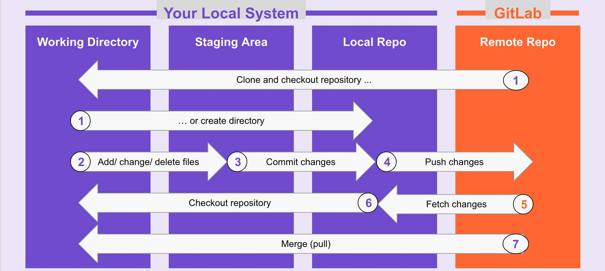
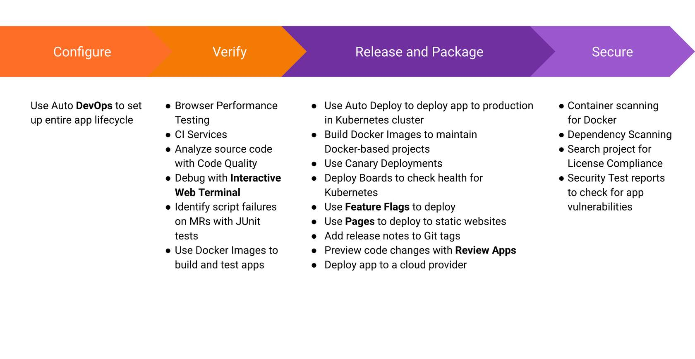

# GitLab

GitLab is a complete open-source DevOps platform, delivered as a single application, fundamentally changing the way Development, Security, and Ops teams collaborate and build software.

2011 - CTO Dmitriy needed a great tool to collaborate with his team. [First Commit](https://gitlab.com/gitlab-org/gitlab-foss/commit/9ba1224867665844b117fa037e1465bb706b3685)
2012- GitLab CI first version after beta announcement on HackerNews

## What makes it different

10 areas of software delivery lifecycle in one place:

- Manage
- Plan
- Create
- Verify
- Package
- Secure
- Release
- Configure
- Monitor
- Defend

Overall:

- Single Application for Entire DevOps Lifecycle
- Leading SCM and CI in One Application
- Built In Security and Compliance
- Deploy Software Anywhere
- Optimized for Kubernetes
- End-to-End Insight and Visibility
- Flexible GitLab Hosting Options
- Rapid Innovation
- Open Source; Everyone Can Contribute
- Collaborative and Transparent Customer Experience

There are over 20 ways to deploy GitLab

[GitLab flow](https://about.gitlab.com/blog/2014/09/29/gitlab-flow/) integrates the Git workflow with an issue tracking system and ability to create dedicated branches for environments and releases.

If you need to cherry-pick a commit with a hotfix, it is common to develop it on a feature branch and merge it into the main with a merge request. In this case, do not delete the feature branch yet.

Environment Branches:
Deals with minor versions
Main (Deployed on Staging) => Pre-Production => Production

Release Branches:
You can use release branches to release software to the outside world. In this case, each branch contains a minor version, for example, 2-3-stable, 2-4-stable, etc.

Merging into the main branch and then cherry-picking into release is called an “upstream first” policy. Every time you include a bug fix in a release branch, increase the patch version by setting a new tag.

### GitLab FLOW Process

1. Create an Issue
   1. Discuss implementation of new idea
   2. Tracking tasks and work status
   3. Accepting feature proposals, questions, support requets, or bug reports
   4. Elaborating on new code implementations
2. Create a Merge Request
   1. Also referred to as Pull Request
   2. Starts the CI/CD process
3. Commit your changes
   1. CI pipeline runs
   2. Review App
4. CI pipeline runs
   1. Initiate code builds
   2. Run automated tests
   3. Deploy branch to staging environment
5. Review Apps
   1. Review apps provide an automatic live preview of changes made in a feature branch by spinning up a dynamic environment for your merge requests.
6. Peer Review & Discussion
   1. Ensure there are no conflicts or edits that need to be made before your commits are finalized.
7. Approve Changes
   1. A person with Merge rights/permissions will need to approve your changes.
8. Merge; Issue Closed
9. CD Pipeline Runs
10. Monitor

**GitLab Components**

- Project
- Group: A collection of projects and/or other groups.
- Issue (Story, Narrative, Ticket): Fundamental planning object
- Epic (Initiatives, Themes): A collection of related issues across different groups and projects to help organize by theme
- Merge Request (Pull Request): The linkage between the issue and the actual code changes.
- Label (Tag): Used to tag and track work for a project or group and associate issues with different initiatives
- Board: A visual listing of projects and issues useful for teams to manage their backlog of work, prioritize items, and move issues to the team or specific stage in the project.
- Milestone (Release): A sprint or deliverable(s), helping you organize code, issues, and merge requests into a cohesive group
- Roadmap: A visual representation of the various epics for the group

## GitLab components and navigation

- Groups
  - Assemble related projects together
  - Grant member access to several projects at once
- Sub-Groups
  - Different visibility can be set per group
  - Separate permissions on parts of code
  - Manage people permissions
- Projects
  - No limit on private projects
- Issues
- Participants

**GitLab Epics**

Epics let you manage your portfolio of projects more efficiently and with less effort by tracking groups of issues that share a theme, across projects and milestones.
For example, you might want to see all of the issues in a project in a roadmap and generate a Gantt chart for your program or portfolio.
An epic is the parent of one or more issues.
An epic is the parent of one or more child epics.

**Issues**

Issues are the basic building blocks of planning development work and are used to collaborate on ideas and planning work in GitLab.
They can be created for:

- Discussing the implementation of a new idea
- Managing an incident
- Asking questions
- Reporting bugs

Single Source of Truth - When you create an issue in GitLab, you can view multiple DevOps Lifecycle Stage properties, such as the related epics, merge requests, milestone dates, boards, roadmaps, labels, and more- it's all connected!

**Anatomy of Issue**

1. Create and Discuss a New Issue
   1. Create, apply discussion label and discuss using comments
2. Code Creation
   1. Code, dev assign issues to themselves and add "Working on" label
3. Commit and Merge Request
   1. Create commit, push to feature-branch, create Merge Request
   2. Backend team changes label to "Frontend"
4. Deploy to Staging
   1. Frontend dev starts working on issue
   2. Developer assigns issue to themselves
   3. Developer adds “Working on” label
   4. Team reviews and refines code
   5. Team stages code
   6. Team changes label to “Staging”
   7. After successful implementation team changes label to “Ready”
5. Ready
   1. Technical documentation team adds "Docs" label
   2. Marketing team adds “Marketing" label
   3. Technical team removes "Docs" label when done
   4. When done, the marketing team removes “Marketing” label and adds “Production” label
6. Deploy to Production
   1. Release team merges MR and deploys feature to production
   2. Release team closes issue

Internal - allows only logged in users on the instance to view the project and its details

## Test Demo

Labeling to be done like `workflow::doing`, this splits the label.

## Git

- Branch: An independent line of development.
- Tag: Mark a specific point in time on a branch.
- Checkout: Get a specific branch to start making out your changes.
- Commit: Add changes made to the repository.
- Push: Send changes to a remote directory.
- Workspace: Directory where you store the repository on your computer.
- Untracked files: New files that Git has not been told to track previously
- Working Area: Files that have been modified but not committed
- Staging Area: Modified/Added files that are marked to go into the next commit
-

Subversion: Subversion is a centralized version control system. This means that there is only ever ONE working copy. This makes it hard to have several developers working on a project as they can only work on it one at a time.

[Git Cheatsheet](https://about.gitlab.com/images/press/git-cheat-sheet.pdf)

`git config --global color.ui auto` Enable some colorization of Git output.

You can stage and commit a change at the same time by using the `git commit -am "commit message"` command to save time!

[Sharing Code Snippets](https://docs.gitlab.com/ee/user/snippets.html)

[Wikis](https://docs.gitlab.com/ee/user/project/wiki/)

`/estimate 2h` in comment can provide estimate for a MR.

Squash commits can be used to provide a single commit into master as a snapshot of what we did in the MR.

One best practice is to use dashes instead of `/` in branch name because `/` breaks url. `feature-some-branch` will allow to do variable setting or so through CI.

Repository can be made hidden and we can have an only Wiki driven repo.

`$207` e.g. is a reference to snippet. Then you can put in comment $207 and it'll attach the hyperlink automatically.

## GitLab CI/CD

**Continuous Integration** is the practice of merging all the code that is being produced by developers. The merging usually takes place several times a day in a shared repository. From within the repository, or production environment, building and automated testing are carried out that ensure no integration issues and the early identification of any problems.

**Continuous Delivery** adds that the software can be released to production at any time, often by automatically pushing changes to a staging system.

**Continuous Deployment** goes further and pushes changes to production automatically.

CI helps you catch and reduce bugs early in the development cycle, and CD moves verified code to your applications faster.

`.gitlab-ci.yml` - The YAML file is the pipeline definition file. It specified the stages, jobs, and actions that you want to perform. Think of the YAML file as the brains, and the runner as the body.

**GitLab Runner**

- A GitLab Runner, a file written in Go, will run the jobs specified in the YAML file using an API to communicate with GitLab.
- Your GitLab administrator can configure shared runners to run on multiple projects, and you can set up your own by project.

**CI/CD Pipeline**

- Stages: Stages are a collection of jobs to be run in parallel. The default stages are Build, Test, and Deploy.
- Jobs: Scripts that perform tasks. The jobs in each stage are executed in parallel.
- Environments: where we deploy to.

Auto DevOps gives you a pre-defined CI/CD configuration which lets you automatically detect, build, test, deploy, and monitor your applications.

## Package and Release

1. Package Registry
   Every team needs a place to store their packages and dependencies. GitLab aims to provide a comprehensive solution, integrated into our single application, that supports package management for all commonly used languages and binary formats.
2. Container Registry
   A container registry is a secure and private registry for Docker images built-in to GitLab. Creating, pushing, and retrieving images works out of the box with GitLab CI/CD.
3. Helm Chart Registry
   Kubernetes cluster integrations can take advantage of Helm charts to standardize their distribution and install processes. Supporting a built-in helm chart registry allows for better, self-managed container orchestration.
4. Dependency Proxy
   The GitLab dependency proxy can serve as an intermediary between your local developers and automation and the world of packages that need to be fetched from remote repositories. By adding a security and validation layer to a caching proxy, you can ensure reliability, accuracy, and audit-ability for the packages you depend on.
5. Jupyter Notebooks
   Jupyter Notebooks are a common type of code used for data-science use cases. With GitLab you can store and version control those notebooks in the same way you store packages and application code.
6. Git LFS
   Git LFS (Large File Storage) is a Git extension, which reduces the impact of large files in your repository by downloading the relevant versions of them lazily. Specifically, large files are downloaded during the checkout process rather than during cloning or fetching.
