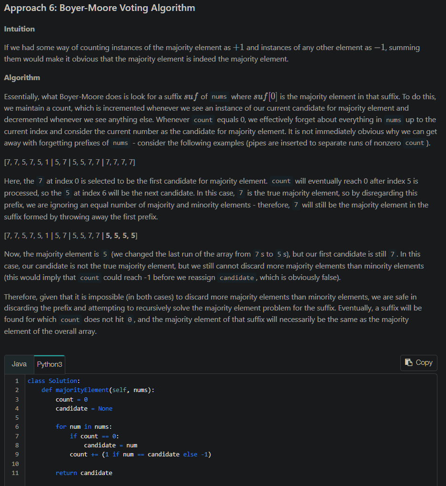

# CC

- [CC](#cc)
  - [Common Algos](#common-algos)
    - [Find unique subsets](#find-unique-subsets)
    - [Find permutations](#find-permutations)
    - [Path of sum exists (DFS)](#path-of-sum-exists-dfs)
    - [Cyclic Sort](#cyclic-sort)
    - [Overlap](#overlap)
      - [Merging overlapping intervals](#merging-overlapping-intervals)
    - [Invert Binary Tree](#invert-binary-tree)
    - [Optimum palindrome check](#optimum-palindrome-check)
    - [GCD LCM](#gcd-lcm)
    - [Sort](#sort)
    - [Speed = Distance / Time](#speed--distance--time)
    - [Trie aka prefix/digital tree](#trie-aka-prefixdigital-tree)
    - [Bayer-Moore Voting Algorithm for Majority element](#bayer-moore-voting-algorithm-for-majority-element)
    - [Add Binary](#add-binary)
    - [LRU Cache](#lru-cache)
    - [Linked List cycle and length](#linked-list-cycle-and-length)
  - [Snippets](#snippets)
    - [Graph](#graph)
    - [XOR](#xor)
    - [Character to ASCII / vice-versa](#character-to-ascii--vice-versa)
    - [String reversal](#string-reversal)
    - [Even length string to odd length](#even-length-string-to-odd-length)
    - [Simple reverse](#simple-reverse)
    - [Key, value interation](#key-value-interation)
    - [List of string numbers to Number](#list-of-string-numbers-to-number)
    - [XOR](#xor-1)
    - [Alphabet char code map](#alphabet-char-code-map)
    - [Looping](#looping)
  - [Problems](#problems)
    - [Permutation of string](#permutation-of-string)
    - [Sliding Window - Max Sub array sum](#sliding-window---max-sub-array-sum)
    - [Length of longest sub string with no repeat chars / Map & 1 pointer](#length-of-longest-sub-string-with-no-repeat-chars--map--1-pointer)
    - [Median of 2 sorted num arrays / 2 pointer](#median-of-2-sorted-num-arrays--2-pointer)
    - [kth Factor of n](#kth-factor-of-n)
    - [Remove overlap](#remove-overlap)
  - [Revisit](#revisit)
    - [Linked List](#linked-list)
      - [Reversal of Singly Linked List](#reversal-of-singly-linked-list)
      - [Reversal of sub-list of LL](#reversal-of-sub-list-of-ll)
      - [Middle Node of LL](#middle-node-of-ll)
    - [Tree](#tree)
      - [Diameter of Binary Tree](#diameter-of-binary-tree)
      - [Max Depth](#max-depth)
      - [Populate next pointer](#populate-next-pointer)
    - [Graph](#graph-1)
      - [Topological sort / Task Scheduling](#topological-sort--task-scheduling)
    - [Dynamic Programming](#dynamic-programming)
      - [Maximum Length of Repeated Subarray](#maximum-length-of-repeated-subarray)
    - [Stack](#stack)
      - [Infix expression evaluation](#infix-expression-evaluation)

## Common Algos

### Find unique subsets

```js
/**
 *  Input: [1, 3]
    Output: [], [1], [3], [1,3]
  Algo: Breadth First Search (BFS)
*/
function find_subsets(nums) {
  const subsets = [];
  // start by adding the empty subset
  subsets.push([]);
  for (i = 0; i < nums.length; i++) {
    currentNumber = nums[i];
    // we will take all existing subsets and insert the current number in them to create new subsets
    const n = subsets.length;
    for (j = 0; j < n; j++) {
      // create a new subset from the existing subset and insert the current element to it
      const set1 = subsets[j].slice(0); // clone the permutation
      set1.push(currentNumber);
      subsets.push(set1);
    }
  }

  return subsets;
}
```

### Find permutations

```js
/**
 * Input: [1,3,5]
 * Output: [1,3,5], [1,5,3], [3,1,5], [3,5,1], [5,1,3], [5,3,1]
 * Time and Space complexity: O(N * N!)
 *
 */
const findPermutations = function (nums) {
  const result = [];
  const permutes = [];
  permutes.push([]);
  // for every num in nums
  for (let i = 0; i < nums.length; i++) {
    const num = nums[i];
    const n = permutes.length;
    // for every intermediate permutation in permutes
    for (let j = 0; j < n; j++) {
      const currPermute = permutes[j];
      // size will be +1 as inserting num in each place of prev. permute
      for (let k = 0; k < currPermute.length + 1; k++) {
        const clonedPermute = [...currPermute];
        clonedPermute.splice(k, 0, num); // at k we insert the num;
        if (clonedPermute.length === nums.length) {
          result.push(clonedPermute);
        } else {
          permutes.push(clonedPermute);
        }
      }
    }
  }
  return result;
};

const result = findPermutations([1, 3, 5]);
result.forEach((permutation) => {
  console.log(permutation);
});

// Recursive approach:

function findPermutation(nums) {
  const result = [];
  findPermuteRecursively(nums, result);
  return result;
}

function findPermuteRecursively(
  nums,
  result,
  index = 0,
  currentPermutation = []
) {
  if (index === nums.length) {
    result.push(currentPermutation);
  } else {
    // create a new permutation by adding the current number at every position
    for (let i = 0; i < currentPermutation.length + 1; i++) {
      newPermutation = [...currentPermutation]; // clone the permutation
      newPermutation.splice(i, 0, nums[index]); // insert nums[index] at index 'i'
      findPermuteRecursively(nums, result, index + 1, newPermutation);
    }
  }
}

const result = findPermutation([1, 3, 5]);
result.forEach((permutation) => {
  console.log(permutation);
});
```

### Path of sum exists (DFS)

```js
function hasPath(root, sum) {
  if (root === null) {
    return false;
  }

  // if the current node is a leaf and its value is equal to the sum, we've found a path
  if (root.val === sum && root.left === null && root.right === null) {
    return true;
  }

  // recursively call to traverse the left and right sub-tree
  // return true if any of the two recursive call return true
  return (
    hasPath(root.left, sum - root.val) || hasPath(root.right, sum - root.val)
  );
}
```

### Cyclic Sort

```js
function cyclic_sort(nums) {
  let i = 0;
  while (i < nums.length) {
    const j = nums[i] - 1; // j is where current number is suppose to be
    if (nums[i] !== nums[j]) {
      // if it isn't
      [nums[i], nums[j]] = [nums[j], nums[i]]; // swap
    } else {
      // only increment when current number is at its right place
      i += 1;
    }
  }
  return nums;
}

console.log(cyclic_sort([3, 1, 5, 4, 2]));
console.log(cyclic_sort([2, 6, 4, 3, 1, 5]));
console.log(cyclic_sort([1, 5, 6, 4, 3, 2]));
```

### Overlap

If `b` overlaps `a` then `b.start <= a.end`. Cases considered:

- b starts in btwn a and ends beyond a
- b range is inside a range
- b range starts with a start but goes beyond a's end.

#### Merging overlapping intervals

```js
class Interval {
  constructor(start, end) {
    this.start = start;
    this.end = end;
  }
}
function merge(intervals) {
  if (intervals.length < 2) {
    return intervals;
  }
  // sort the intervals on the start time
  intervals.sort((a, b) => a.start - b.start);

  const mergedIntervals = [];
  let start = intervals[0].start,
    end = intervals[0].end;
  for (i = 1; i < intervals.length; i++) {
    const interval = intervals[i];
    if (interval.start <= end) {
      // overlapping intervals, adjust the 'end'
      end = Math.max(interval.end, end);
    } else {
      // non-overlapping interval, add the previous interval and reset
      mergedIntervals.push(new Interval(start, end));
      start = interval.start;
      end = interval.end;
    }
  }
  // add the last interval
  mergedIntervals.push(new Interval(start, end));
  return mergedIntervals;
}
```

### Invert Binary Tree

```js
// Recursion
function invertTree(root) {
  if (root == null) return root;
  [root.left, root.right] = [invertTree(root.right), invertTree(root.left)];
  return root;
}

// DFS
function invertTree(root) {
  const stack = [root];

  while (stack.length) {
    const n = stack.pop();
    if (n != null) {
      [n.left, n.right] = [n.right, n.left];
      stack.push(n.left, n.right);
    }
  }

  return root;
}

// BFS
function invertTree(root) {
  const queue = [root];

  while (queue.length) {
    const n = queue.shift();
    if (n != null) {
      [n.left, n.right] = [n.right, n.left];
      queue.push(n.left, n.right);
    }
  }

  return root;
}
```

### Optimum palindrome check

Check if each letter is the same as its mirror equivalent — or, a character on the other side (measured with index — 1)

```js
function checkPalindrome(substr) {
  let l = substr.length;
  for (let i = 0; i < l / 2; i++) {
    if (substr[i] !== substr[l - 1 - i]) {
      return false;
    }
  }
  return true;
}
```

```js
// short version
function isPalin(word, i, j) {
  while (i < j) if (word[i++] !== word[j--]) return false;
  return true;
}
```

### GCD LCM

```js
// greatest common divisor (GCD) of two integers is the largest positive integer dividing both.
const gcd = (a, b) => (a ? gcd(b % a, a) : b);

// least common multiple (LCM) of two integers is the smallest positive integer that is a multiple of both
const lcm = (a, b) => (a * b) / gcd(a, b);
```

### Sort

```js
const arr = [1, 2];
// ASC
arr.sort((a, b) => a - b);
// DESC
arr.sort((a, b) => b - a);
```

### Speed = Distance / Time

```js
// Example
let time = (target - currentDistance) / speedOfCar;
```

### Trie aka prefix/digital tree

It's an ordered tree where nodes of tree store the entire alphabet and words can be re`trie`ved by traversing down a branch.

Operations: word - insert, remove and contains. Prefix - `find(prefix)`

Root node is empty

```js
// Properties
const TrieNode = function (char: characterInSequence) {
  this.char = characterInSequence;
  this.parent = null;
  this.children = {};
  this.isEndOfWord = false;
  // ...methods
};

const Trie = function () {
  this.root = new TrieNode(null);
  // ...methods
};
```

Trie’s retrieval/insertion time in the worst case is better than hashTable and binary search trees. Requires a lot of memory storage for strings. Easy to print all words in alphabetical order

### Bayer-Moore Voting Algorithm for Majority element



```js
function findMajority(nums) {
  let count = 0;
  let candidate = -1;

  // Finding majority candidate
  for (let i = 0; i < nums.length; i++) {
    if (count == 0) {
      candidate = nums[i];
      count = 1;
    } else {
      if (nums[i] === candidate) count++;
      else count--;
    }
  }

  // Checking if majority candidate occurs more than (optional if majority element is for sure present)
  // n/2 times
  count = 0;
  for (let i = 0; i < nums.length; i++) {
    if (nums[i] == candidate) count++;
  }
  if (count > nums.length / 2) {
    return candidate;
  }
  return -1;
}
```

### Add Binary

```js
/**
 * a = "11", b = "1" => "100"
 */
var addBinary = function (a, b) {
  // Short with BigInt
  const aBin = `0b${a}`;
  const bBin = `0b${b}`;
  const sum = BigInt(aBin) + BigInt(bBin);
  return sum.toString(2);
};
```

```js
var addBinary = function (a, b) {
  // Easier to understand
  a = a.split("").reverse().join("");
  b = b.split("").reverse().join("");
  len = a.length > b.length ? a.length : b.length;
  result = [];
  for (let i = 0; i < len; i += 1) {
    num1 = Number(a[i] || 0);
    num2 = Number(b[i]) || 0;
    curr = Number(result[i] || 0) + num1 + num2;
    if (curr >= 2) {
      result[i] = curr % 2;
      result.push(1);
    } else {
      result[i] = curr;
    }
  }
  return result.reverse().join("");
};
```

### LRU Cache

```js
/**
 * @param {number} capacity
 */
var LRUCache = function (capacity) {
  /** Map is ordered dict as in python. */
  this.cache = new Map();
  this.capacity = capacity;
};

/**
 * @param {number} key
 * @return {number}
 */
LRUCache.prototype.get = function (key) {
  if (!this.cache.has(key)) return -1;
  const v = this.cache.get(key);
  this.cache.delete(key);
  this.cache.set(key, v);
  return this.cache.get(key);
};

/**
 * @param {number} key
 * @param {number} value
 * @return {void}
 */
LRUCache.prototype.put = function (key, value) {
  if (this.cache.has(key)) {
    this.cache.delete(key);
  }
  this.cache.set(key, value);
  if (this.cache.size > this.capacity) {
    /** .keys() returns Map interator. That's why .next() */
    this.cache.delete(this.cache.keys().next().value); // keys().next().value returns first item's key
  }
};
```

### Linked List cycle and length

**Find if cycle exists**

```js
class Node {
  constructor(value, next = null) {
    this.value = value;
    this.next = next;
  }
}

function has_cycle(head) {
  let slow = head,
    fast = head;
  while (fast !== null && fast.next !== null) {
    fast = fast.next.next;
    slow = slow.next;
    if (slow === fast) {
      return true; // found the cycle
    }
  }
  return false;
}
```

**Find length of cycle**

```js
function find_cycle_length(head) {
  let slow = head,
    fast = head;

  while (fast !== null && fast.next !== null) {
    fast = fast.next.next;
    slow = slow.next;
    if (slow === fast) {
      // found the cycle
      return calculate_cycle_length(slow);
    }
  }
  return 0;
}

function calculate_cycle_length(slow) {
  let current = slow,
    cycle_length = 0;
  while (true) {
    current = current.next;
    cycle_length += 1;
    if (current === slow) {
      break;
    }
  }
  return cycle_length;
}
```

**Find start of cycle**

```js
function find_start(head, cycle_length) {
  let pointer1 = head,
    pointer2 = head;
  // move pointer2 ahead 'cycle_length' nodes
  while (cycle_length > 0) {
    pointer2 = pointer2.next;
    cycle_length -= 1;
  }
  // increment both pointers until they meet at the start of the cycle
  while (pointer1 !== pointer2) {
    pointer1 = pointer1.next;
    pointer2 = pointer2.next;
  }

  return pointer1;
}
```

## Snippets

### Graph

```js
class Graph {
  constructor() {
    this.adjacencyList = {};
  }
  addVertex(vertex) {
    if (!this.adjacencyList[vertex]) {
      this.adjacencyList[vertex] = [];
    }
  }
  addEdge(source, destination) {
    if (!this.adjacencyList[source]) {
      this.addVertex(source);
    }
    if (!this.adjacencyList[destination]) {
      this.addVertex(destination);
    }
    this.adjacencyList[source].push(destination);
    this.adjacencyList[destination].push(source);
  }
  removeEdge(source, destination) {
    this.adjacencyList[source] = this.adjacencyList[source].filter(
      (vertex) => vertex !== destination
    );
    this.adjacencyList[destination] = this.adjacencyList[destination].filter(
      (vertex) => vertex !== source
    );
  }
  removeVertex(vertex) {
    while (this.adjacencyList[vertex]) {
      const adjacentVertex = this.adjacencyList[vertex].pop();
      this.removeEdge(vertex, adjacentVertex);
    }
    delete this.adjacencyList[vertex];
  }

  bfs(start) {
    const queue = [start];
    const result = [];
    const visited = {};
    visited[start] = true;
    let currentVertex;
    while (queue.length) {
      currentVertex = queue.shift();
      result.push(currentVertex);
      this.adjacencyList[currentVertex].forEach((neighbor) => {
        if (!visited[neighbor]) {
          visited[neighbor] = true;
          queue.push(neighbor);
        }
      });
    }
    return result;
  }

  dfsIterative(start) {
    const result = [];
    const stack = [start];
    const visited = {};
    visited[start] = true;
    let currentVertex;
    while (stack.length) {
      currentVertex = stack.pop();
      result.push(currentVertex);
      this.adjacencyList[currentVertex].forEach((neighbor) => {
        if (!visited[neighbor]) {
          visited[neighbor] = true;
          stack.push(neighbor);
        }
      });
    }
    return result;
  }
}
```

### XOR

Maximum from XOR of 2 numbers is found by flipping bits of one number.

```
Let maximumBit = 3

XOR = 1 (001) :  we can choose to xor it with 6 so that maximum xor for query will become '2^maximumBit - 1 = 7'
    ^ 6 (110)
    ----------
      111
```

### Character to ASCII / vice-versa

```js
"a".charCodeAt(0); // 97
```

```js
String.fromCharCode(97); // a
```

### String reversal

```js
Array.from("abc").reverse().join(""); // cba
```

```js
function reverse(string, i, j) {
  let arr = string.split("");
  while (i < j) {
    let temp = arr[i];
    arr[i++] = arr[j];
    arr[j--] = temp;
  }
  return arr.join("");
}
```

### Even length string to odd length

```js
// fill with filler
Array.from("ab").join("#"); // a#b
```

### Simple reverse

```js
n = 654321;
rev = 0;
while (n > 0) {
  a = n % 10;
  rev = rev * 10 + a;
  n = Math.floor(n / 10);
}
console.log("reversed n ", rev); // 123456
```

### Key, value interation

```js
for (const [k, v] of Object.entries({ a: 1, b: 2 })) {
  console.log("k ", k, " v ", v);
}
```

### List of string numbers to Number

```js
["2", "3"].map((x) => +x);
```

### XOR

```js
true ^ false; // 1
true ^ true; // 0
```

### Alphabet char code map

```js
var createMap = (str) => {
  let res = new Array(26).fill(0);

  for (let char of str) {
    res[char.charCodeAt() - 97]++;
  }
  return res;
};
```

### Looping

```js
for (let i = 1; i <= m; i += 1) {
  // row
  for (let j = 1; j <= m - i; j += 1) {} // column with j decreasing everytime by i traversals
}
```

For creating adjacency matrix from 1D array:

```js
for (let i = 0; i < arr.length; i++) {
  for (let j = i + 1; j < arr.length; j++) {}
}
```

## Problems

### Permutation of string

```js
// Backtrack

function permute(data, i, length) {
  if (i === length) {
    console.log(data.join(""));
  } else {
    for (let k = i; k < length; k++) {
      [data[i], data[k]] = [data[k], data[i]];
      permute(data, i + 1, length);
      [data[i], data[k]] = [data[k], data[i]]; // backtrack
    }
  }
}
permute(Array.from("abc"), 0, 3);
```

```js
// Divide and Conquer

const findPermutations = (string) => {
  const isJustOneCharacterLong = string.length === 1;
  const noWayToPermute = isJustOneCharacterLong;
  if (noWayToPermute) return string;
  const permuteArr = [];
  for (let i = 0; i < string.length; i++) {
    const currentChar = string[i];
    const firstIdxOccurence = string.indexOf(currentChar);
    const isCharARepeat = firstIdxOccurence != i;
    if (isCharARepeat) continue; // skip

    const remainingCharactersThatCanBePermutated =
      string.slice(0, i) + string.slice(i + 1, string.length);
    for (let permutation of findPermutations(
      remainingCharactersThatCanBePermutated
    )) {
      permuteArr.push(currentChar + permutation);
    }
  }
  return permuteArr;
};
console.log(findPermutations("aabc"));
```

```js
const permutator = (inputArr) => {
  let result = [];
  const permute = (arr, m = []) => {
    if (arr.length === 0) {
      result.push(m);
    } else {
      for (let i = 0; i < arr.length; i++) {
        let curr = [...arr];
        let next = curr.splice(i, 1);
        // console.log("next ", next, " curr ", curr, " m ", [...m, ...next]);
        permute([...curr], [...m, ...next]);
      }
    }
  };
  permute(inputArr);
  return result;
};
permutator([..."cat"]);
```

### Sliding Window - Max Sub array sum

```js
const maxSubArraySum = (arr, n) => {
  let tempSum = 0;
  let maxSum = 0;
  for (let i = 0; i < n; i++) {
    tempSum += arr[i];
  } // first n numbers sum taken as the temporary sum
  maxSum = tempSum;
  // Goes n...arr.length-1
  for (let i = n; i < arr.length; i++) {
    let numFromLeft = arr[i - n]; // 0...arr.length-n
    tempSum = tempSum - numFromLeft + arr[i]; // we remove idx from left side of window and add next idx to window
    maxSum = Math.max(tempSum, maxSum);
  }
  return maxSum;
};

maxSubarraySum([1, 2, 5, 2, 8, 1, 5], 4); // 17
```

### Length of longest sub string with no repeat chars / Map & 1 pointer

e.g. "aa" => 1, "dvdf" -> 3

```js
function longestSubstringLength(s) {
  const seen = new Map();
  let start = 0; // start index of current substring which has non-repeating chars
  let maxLen = 0;
  for (let i = 0; i < s.length; i++) {
    // if char previously seen then start moves ahead of last seen char pos
    // max helps to keep start moving forward and never back
    if (seen.has(s[i])) start = Math.max(seen.get(s[i]) + 1, start);
    seen.set(s[i], i);
    const currentSubstringLength = i - start + 1;
    maxLen = Math.max(currentSubstringLength, maxLen);
  }
  return maxLen;
}
```

### Median of 2 sorted num arrays / 2 pointer

```
nums1 = [1,3], nums2 = [2] => 2.0
Exp: merged array = [1,2,3] and median is 2.

nums1 = [1,2], nums2 = [3,4] => 2.5
Exp: merged array = [1,2,3,4] and median is (2 + 3) / 2 = 2.5.
```

```js
/**
 * @param {number[]} nums1
 * @param {number[]} nums2
 * @return {number}
 */
var findMedianSortedArrays = function (nums1, nums2) {
  let finalLength = nums1.length + nums2.length;
  const isEven = finalLength % 2 === 0;
  let midIdx = isEven
    ? Math.ceil(finalLength / 2)
    : Math.floor(finalLength / 2);
  if (!nums1.length) {
    // [] and [1]
    nums1[0] = Infinity;
  }
  if (!nums2.length) {
    // [1] and []
    nums2[0] = Infinity;
  }
  let leftPtr = 0;
  let rightPtr = 0;
  let smallerStartArr = nums1[0] >= nums2[0] ? nums2 : nums1;
  let otherArr = smallerStartArr === nums1 ? nums2 : nums1;
  let combinedArr = [];
  while (leftPtr < smallerStartArr.length) {
    if (rightPtr >= otherArr.length) {
      combinedArr.push(smallerStartArr[leftPtr]);
      leftPtr++;
    } else if (smallerStartArr[leftPtr] <= otherArr[rightPtr]) {
      combinedArr.push(smallerStartArr[leftPtr]);
      leftPtr++;
    } else {
      combinedArr.push(otherArr[rightPtr]);
      rightPtr++;
    }
    if (combinedArr.length > midIdx) break;
  }
  const maxIdxInCombined = combinedArr.length - 1;
  if (!isEven)
    return maxIdxInCombined >= midIdx
      ? combinedArr[midIdx]
      : otherArr[Math.abs(combinedArr.length - midIdx) + rightPtr];
  const idx1 = midIdx - 1;
  const idx2 = midIdx;
  const num1 =
    maxIdxInCombined >= idx1
      ? combinedArr[idx1]
      : otherArr[Math.abs(combinedArr.length - idx1) + rightPtr];
  const num2 =
    maxIdxInCombined >= idx2
      ? combinedArr[idx2]
      : otherArr[Math.abs(combinedArr.length - idx2) + rightPtr];
  return (num1 + num2) / 2;
};
```

### kth Factor of n

```
n = 12, k = 3 => 3
Factors: [1,2,3,4,6,12] then 3rd factor is 3.
```

```
n = 4, k = 4 => -1
```

```js
var kthFactor = function (n, k) {
  const factors = [];
  for (let i = 1; i <= n; i++) {
    if (n % i === 0) factors.push(i);
  }
  return factors?.[k - 1] || -1;
};
```

### Remove overlap

return the minimum number of intervals you need to remove to make the rest of the intervals non-overlapping

```
[[1,2],[2,3],[3,4],[1,3]] => 1
i.e. [1,3] can be removed and rest are non-overlapping

[[1,2],[1,2],[1,2]] => 2

[[1,2],[2,3],[3,4],[-100,-2],[5,7]] => 0
```

```js
const eraseOverlapIntervals = (intervals) => {
	intervals.sort((a,b) => a[1] - b[1]); // ascending order wrt the end
	let pre = null;
	let counter = 0;
	intervals.forEach((item) => {
		if (!pre) pre = item;
		else {
			if (pre[1] > item[0]) counter++;
			else pre = item;
		}
	}
	return counter;
}
```

## Revisit

### Linked List

#### Reversal of Singly Linked List

2 ptrs: previous (`null`) and current (`head`)

```js
/**
 * @param {ListNode} head
 * @return {ListNode}
 */

// ES6
var reverseList = function (head) {
  let [prev, current] = [null, head];
  while (current) {
    [current.next, prev, current] = [prev, current, current.next];
  }
  return prev;
};

// Plain
function reverseList(head) {
  var prev = null;
  while (head) {
    var next = head.next;
    head.next = prev;
    prev = head;
    head = next;
  }
  return prev;
}
```

#### Reversal of sub-list of LL

```js
// I/P => 1 -> 2 -> 3 -> 4 -> 5 -> null
// O/P => 1 -> 4 -> 3 -> 2 -> 5 -> null
const reverse_sub_list = function (head, p, q) {
  let [prev, curr] = [null, head];
  let i = 0;
  while (curr !== null && i < p - 1) {
    // skip p-1 nodes
    prev = curr;
    curr = curr.next;
    i++;
  }
  // prev => 1
  // curr => 2

  const leftFirstPrev = prev;
  const lastNodeOfSubList = curr;
  let next = null;
  i = 0;
  /**
   * Component  Before:   After(i=0):   After(i=1):   After(i=2):
   * next       null      3             4             5
   * curr.next  3         1             2             3
   * prev       1         2             3             4
   * curr       2         3             4             5
   */
  while (curr !== null && i < q - p + 1) {
    next = curr.next;
    curr.next = prev;
    prev = curr;
    curr = next;
    i++;
  }

  if (leftFirstPrev !== null) {
    leftFirstPrev.next = prev; // 1.next => 4
  } else {
    head = prev;
  }
  lastNodeOfSubList.next = curr; // 2.next => 5
  return head;
};
```

#### Middle Node of LL

```js
var middleNode = function (head) {
  let slow = (fast = head);
  while (fast && fast.next) {
    slow = slow.next;
    fast = fast.next.next;
  }
  return slow;
};
```

### Tree

#### Diameter of Binary Tree

Given the root of a binary tree, return the length of the diameter of the tree.

```js
function diameterOfBinaryTree(root) {
  let max = 0;

  function maxDepth(root) {
    if (root === null) return 0; // if our root(num) is null then there is no path. return 0/null
    let left = maxDepth(root.left); // Assign the left  of tree to LEFT; this will be easier to call it instead of writing "maxDepth(root.left)" each time
    let right = maxDepth(root.right); //Same above

    max = Math.max(max, left + right); //if the path doesn't go through the root we just get the max of them
    return Math.max(left, right) + 1; // the path goes through the root so we add 1(for the root)
  }
  //since we don't know if the path will go through the root or not we will have to get the max between(path that visits the root, or the path that doesn't go through the root.)
  maxDepth(root);
  return max;
}
```

#### Max Depth

```js
var maxDepth = function (root) {
  if (root === undefined || root === null) {
    return 0;
  }
  return Math.max(maxDepth(root.left), maxDepth(root.right)) + 1;
};
```

#### Populate next pointer

Populate each next pointer to point to its next right node.

```js
/**
struct Node {
  int val;
  Node *left;
  Node *right;
  Node *next;
}

Input: root = [1,2,3,4,5,6,7]
Output: [1,#,2,3,#,4,5,6,7,#]
*/
var connect = function (root) {
  if (!root) return root;
  let result = [];
  const queue = [root];
  while (queue.length) {
    let levelSize = queue.length;
    let currentLevel = [];
    for (let i = 0; i < levelSize; i++) {
      const node = queue.shift();
      currentLevel.push(node);
      if (node.left) {
        if (queue[queue.length - 1]) {
          queue[queue.length - 1].next = node.left;
        }
        queue.push(node.left);
      }
      if (node.right) {
        if (queue[queue.length - 1]) {
          queue[queue.length - 1].next = node.right;
        }
        queue.push(node.right);
      }
    }
    currentLevel[currentLevel.length - 1].next = null;
    result.push(currentLevel);
  }
  return root;
};
```

### Graph

#### Topological sort / Task Scheduling

Worded algo:

1. Init
   1. `sortedOrder` => empty array which will contain vertices in sorted order.
   2. `inDegree` => `Array(noOfVertices)` for accounting number of directed edges on a vertex
   3. `graph` => `[[]]` 2D array with 1 row x n vertices which builds the adjacency graph. (`graph[parentVertex] = childVertex`)
2. Build graph by going through each edge. Also increment `inDegree` for child vertex
3. `sources` (queue) => loop through `inDegree` and push vertices with 0 `inDegree` to `sources`
4. While we have `sources.length`
   1. `shift()` a source vertex
   2. Push above vertex to `sortedOrder` array
   3. For each child of above vertex, decrement `inDegree` and if new `inDegree` of child vertex is `0` then push it to `sources`
5. Graph has cycle/tasks can't be scheduled be `sortedOrder.length` !== `noOfVertices`
6. Return `sortedOrder`

```js
function topological_sort(vertices, edges) {
  const sortedOrder = [];
  if (vertices <= 0) {
    return sortedOrder;
  }

  // a. Initialize the graph
  const inDegree = Array(vertices).fill(0); // count of incoming edges
  const graph = Array(vertices)
    .fill(0)
    .map(() => Array()); // adjacency list graph

  // b. Build the graph
  edges.forEach((edge) => {
    let parent = edge[0],
      child = edge[1];
    graph[parent].push(child); // put the child into it's parent's list
    inDegree[child]++; // increment child's inDegree
  });

  // c. Find all sources i.e., all vertices with 0 in-degrees
  const sources = []; // should be queue
  for (i = 0; i < inDegree.length; i++) {
    if (inDegree[i] === 0) {
      sources.push(i);
    }
  }

  // d. For each source, add it to the sortedOrder and subtract one from all of its children's in-degrees
  // if a child's in-degree becomes zero, add it to the sources queue
  while (sources.length > 0) {
    const vertex = sources.shift();
    sortedOrder.push(vertex);
    graph[vertex].forEach((child) => {
      // get the node's children to decrement their in-degrees
      inDegree[child] -= 1;
      if (inDegree[child] === 0) {
        sources.push(child);
      }
    });
  }

  // topological sort is not possible as the graph has a cycle
  if (sortedOrder.length !== vertices) {
    return [];
  }

  return sortedOrder;
}

console.log(
  `Topological sort: ${topological_sort(4, [
    [3, 2],
    [3, 0],
    [2, 0],
    [2, 1],
  ])}`
);
```

### Dynamic Programming

Maximization, minimization, optimization or counting problems

#### Maximum Length of Repeated Subarray

```js
var findLength = function (nums1, nums2) {
  const dp = Array(nums1.length + 1)
    .fill(0)
    .map(() => Array(nums2.length + 1).fill(0));
  let max = 0;
  for (let i = 1; i < nums1.length + 1; i++) {
    for (let j = 1; j < nums2.length + 1; j++) {
      if (nums1[i - 1] === nums2[j - 1]) {
        dp[i][j] = 1 + dp[i - 1][j - 1];
        if (dp[i][j] > max) {
          max = dp[i][j];
        }
      }
    }
  }
  return max;
};
```

### Stack

#### Infix expression evaluation

```js
// I/P: 2 * (5 * (3 + 6)) / 5 - 2
// O/P: 16
// Ref: https://www.codingninjas.com/codestudio/library/expression-evaluation-using-stack

const evaluate = (exp) => {
  const operands = [];
  const operators = [];
  for (let i = 0; i < exp.length; i++) {
    const char = exp[i];
    const isDigit = (c) => !isNaN(parseInt(c, 10));
    const isOperator = (c) =>
      c === "+" || c === "-" || c === "/" || c === "*" || c === "^";
    if (isDigit(char)) {
      let num = "";
      while (isDigit(exp[i])) {
        num += exp[i];
        i++;
      }
      i--;
      operands.push(parseInt(num, 10));
    } else if (char === "(") {
      operators.push(char);
    } else if (char === ")") {
      while (operators.at(-1) !== "(") {
        const output = performOperation(operands, operators);
        operands.push(output); //push result back to stack
      }
      operators.pop();
    } else if (isOperator(char)) {
      const precedence = (c) => {
        switch (c) {
          case "+":
          case "-":
            return 1;
          case "*":
          case "/":
            return 2;
          case "^":
            return 3;
        }
        return -1;
      };
      while (
        operators.length > 0 &&
        precedence(char) <= precedence(operators.at(-1))
      ) {
        const output = performOperation(operands, operators);
        operands.push(output); //push result back to stack
      }
      operators.push(char); //push the current operator to stack
    }
  }
  while (operators.length > 0) {
    const output = performOperation(operands, operators);
    operands.push(output); // push final result back to stack
  }
  return operands.pop();
};

function performOperation(operands, operators) {
  const a = operands.pop();
  const b = operands.pop();
  const operation = operators.pop();
  switch (operation) {
    case "+":
      return a + b;
    case "-":
      return b - a;
    case "*":
      return a * b;
    case "/":
      if (a == 0) {
        console.log("Cannot divide by zero");
        return 0;
      }
      return b / a;
  }
  return 0;
}

const expression = "2*(5*(3+6))/5-2";

console.log(evaluate(expression));
```
